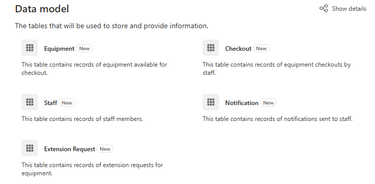

---
lab:
  title: 'Lab 1: Creare una soluzione con Progettazione piani'
  learning path: 'Learning Path: Describe the business value of Microsoft Power Platform'
  module: 'Module 2: Describe the business value of extending business solutions by using Microsoft Power Platform'
---

## Obiettivo di apprendimento

In questo esercizio gli studenti useranno Progettazione piani per creare una soluzione aziendale completa e mirata che può includere app, flussi di lavoro, agenti e altro ancora. Copilot guiderà l'utente nell'intero processo di creazione della soluzione.

Al termine di questo lab, si eseguiranno le operazioni seguenti:

- Usare Progettazione piani per compilare una soluzione.
- Usare l'agente dati per compilare un modello di dati.
- Usare l'agente della soluzione per generare i diversi componenti necessari.

### Scenario

Contoso Consulting è un'organizzazione di servizi professionali specializzata in servizi di consulenza IT e di intelligenza artificiale. Poiché sono passati a un modello di lavoro ibrido, molti dei dipendenti di Contoso lavorano da casa. Ciò causa problemi poiché i dipendenti spesso devono controllare le attrezzature.

Contoso vuole usare Power Platform per creare una soluzione per gestire l'archiviazione e la disconnessità delle apparecchiature.

In questo esercizio si userà Progettazione piani in Microsoft Power Platform per fornire una descrizione della sfida aziendale che si sta tentando di risolvere e usare i consigli per creare una soluzione

> [!IMPORTANT]
> Questo lab usa l'intelligenza artificiale per compilare i componenti. Poiché i risultati dell'intelligenza artificiale possono variare, è importante notare che i risultati possono essere diversi (ma simili) a quanto definito nel lab. I concetti di base descritti nel lab saranno gli stessi indipendentemente da ciò che è stato creato o da quello che è stato denominato. Se gli oggetti suggeriti/creati non corrispondono esattamente a quanto elencato nelle istruzioni, potrebbe essere necessario apportare modifiche in base a ciò che è stato creato.

### Intervallo lab

Il tempo stimato per completare questo esercizio è **compreso tra 20 e 30** minuti.

## Attività 1: Usare Progettazione piani per creare un piano di soluzione

**Usare Progettazione piani**

1. Aprire il portale di [Power Apps maker](https://make.powerapps.com) e passare alla **schermata Home** .
2. In **Let's make a plan (Facciamo un piano**) immettere il testo seguente: "*Ho bisogno del mio personale di controllare le attrezzature e ricevere una notifica delle date di scadenza".*

3. Selezionare il pulsante **Vai**.
4. Progettazione piani genererà un piano in base alla descrizione specificata. Il piano includerà quanto segue:
    - Problema aziendale
    - Scopo di questo piano
    - Requisiti dell'utente

L'agente **** Requisiti ha compilato i requisiti utente in base alla descrizione specificata e deve essere considerato come punto di partenza per il piano. È possibile modificare i requisiti in base alle esigenze.

5. Per modificare i requisiti, selezionare il **pulsante Modifica** .
6. **Nel campo Copilot** sotto l'intestazione **Requisiti utente** immettere: "*Il personale deve essere in grado di segnalare se si verifica un problema con l'attrezzatura mentre è stato* estratto".
7. Selezionare il pulsante **Vai**.

Al piano verrà aggiunto un nuovo requisito di segnalazione dei problemi.

8. Una volta soddisfatti i requisiti elencati, selezionare il **pulsante Mantieni** .
9. Se si è soddisfatti dei requisiti generati dall'agente **** Requisiti, selezionare **Sembra buono**.

L'agente **** del modello di dati consente quindi di creare il modello di dati. Verranno forniti suggerimenti sulle tabelle da creare per archiviare i dati per la soluzione.

10.  Per visualizzare i dettagli del modello, selezionare **Mostra dettagli**.

Tutte le tabelle, le colonne e le relazioni suggerite verranno visualizzate in Progettazione modelli di dati. È possibile usare il riquadro Copilot per apportare modifiche al modello di dati.

11.  **Nel riquadro Copilot** sul lato destro della schermata immettere quanto segue: "*Aggiungere una colonna di testo alla tabella Equipment denominata Numero articolo".*
12.  Dopo aver aggiunto la colonna alla **tabella Equipment** , usare **Copilot** per immettere singolarmente le istruzioni seguenti:
    - "Aggiungere una nuova colonna di testo alla tabella Staff/Employee denominata Manager".
    - "Aggiungere una nuova colonna di scelta alla tabella Equipment denominata Equipment Type".
    - "Aggiungere una nuova colonna di scelta alla tabella Equipment denominata Equipment Type. “

Il modello di dati dovrebbe essere simile a quello elencato.

> [!NOTE]
> > Probabilmente non corrisponderà esattamente. E questo è ok.

13.  Usando lo spostamento a sinistra, selezionare l'icona **Panoramica** . *(Situato sotto la freccia Indietro.*
14.  Nell'agente **** dati selezionare **Sembra buono** per passare al passaggio successivo.

Successivamente, l'agente **della** soluzione fornirà suggerimenti per elementi diversi. In questo caso è consigliabile che l'agente crei due applicazioni Canvas, un flusso di Power Automate e un agente. *(I tuoi potrebbero essere diversi)*

15.  Nell'agente **della** soluzione selezionare il **pulsante Modifica** .
16.  **Nel campo Copilot**, sotto l'intestazione Tecnologia, immettere quanto segue: *"Creare un agente di checkout degli articoli per rispondere alle domande dei dipendenti".*
17.  Selezionare il pulsante **Vai**.
18.  Verrà aggiunto un **agente** di checkout degli articoli. Selezionare **Mantieni**.
19.  Se si è soddisfatti dei suggerimenti dell'agente **di** soluzioni, selezionare **Sembra buono**.
20.  Selezionare **Salva tabelle** per compilare il modello di dati suggerito.

Progettazione piani compila i file di soluzione per tutti i piani creati. Una soluzione è un componente fondamentale della gestione del ciclo di vita delle applicazioni ( ALM).

21.  **Nella schermata Where do you want to save thigs (Dove salvare i** ladri) impostare Il nome della soluzione su Equipment Checkout System e selezionare il **pulsante Salva**.

La creazione di tutti gli elementi suggeriti da Progettazione piani può richiedere da 1 a 3 minuti. Dopo aver salvato il messaggio che indica che le tabelle sono state salvate, selezionare la **X** per chiudere il messaggio di visualizzazione.

## Attività 2: Creare e modificare le app della soluzione del piano

Ora che progettazione piani ha creato tutte le tabelle necessarie e fornito suggerimenti per gli oggetti da creare, verrà compilato ciò che è stato suggerito. Inizieremo creando l'app Equipment Checkout.

1.  Assicurarsi di avere aperto il **piano di sistema di checkout** attrezzature.
2.  **Nel riquadro Panoramica** piano è ancora visualizzato selezionare il pulsante Comprimi per fornire spazio di progettazione in modalità. *(In alto a destra nel riquadro di panoramica).*
3.  **Nella finestra Progettazione** individuare l'app **** Di checkout attrezzature e selezionare il **pulsante Crea**. *Power Apps creerà rapidamente l'app.*

Una volta creata l'applicazione, verranno apportate alcune modifiche di base. Prima di eseguire questa operazione, esaminiamo l'app.

4.  Selezionare la **schermata** iniziale. *Fornisce accesso rapido a elementi quali prenotazioni, checkout ed estensioni.*
5.  Selezionare la **schermata Riserva entità/Estrazione** . *Consente di creare nuove, visualizzare, modificare ed eliminare prenotazioni/checkout.*
6.  Passare alle schermate aggiuntive, ad **esempio Richieste** di estensioni e **notifiche** *(o a qualsiasi schermata creata per l'app).*
7.  Selezionare la **schermata iniziale.**
8.  Selezionare l'immagine precedente **Riserva entità/estrazione.**
9.  Dal menu visualizzato selezionare **Modifica **** \> immagini stock.**
10.  **Nella casella Cerca** immettere **Apparecchiature**.
11.  Selezionare una delle immagini suggerite dall'elenco e selezionare il **pulsante Inserisci** . *(**FACOLTATIVO:** *Ripetere come desiderato per le immagini rimanenti)*
12.  Selezionare la descrizione** sotto il **testo Riserva entità/estrazione.
13. Sulla barra dei **comandi selezionare il **pulsante Proprietà**.** *(Situato a destra del pulsante Modifica.*
14. Modificare la **proprietà Text** in: "Avviare una prenotazione nuova o visualizzare una prenotazione esistente".
15. Selezionare il **testo Riserva entità/Estrazione** ,
16. Modificare la proprietà Text in "Reserve Equipment".
17. Selezionare il **testo della schermata** iniziale nella parte superiore della schermata.
18. Modificare la **proprietà Text** in "Contoso Equipment Checkout".
19. **Nel riquadro Proprietà**, in **Stile e tema**, modificare il colore di riempimento in **Blu scuro**. Selezionare l'immagine sopra **Staff**.

La schermata** iniziale delle app **sarà simile all'immagine mostrata:

È possibile apportare modifiche aggiuntive come desiderato, ma per il momento verrà testata l'applicazione.

20.  Sulla barra dei comandi selezionare l'icona **Riproduci** . Si* noti che il layout dell'app cambierà in base alle dimensioni* dello schermo.
21.  Selezionare l'immagine **Riserva attrezzature** .
22.  Per modificare il record, selezionare il pulsante **Modifica**.
23.  Modificare il **nome** del record.
24.  Selezionare l'icona **Segno di spunta** per salvare le modifiche.
25.  Selezionare il **pulsante Home** per tornare alla **schermata iniziale**.
26.  Nell'angolo superiore destro dell'app selezionare viola **X** per tornare alla finestra di progettazione.
27.  Sulla barra dei **comandi selezionare l'icona Salva** per salvare l'app**.**
28.  Chiudere la **scheda Browser** per tornare a **Progettazione Planner**. Si* noti che il pulsante sotto l'app è cambiato da crea a modifica.*

> [[!NOTE]
> Se vuoi ripetere i passaggi precedenti, puoi anche creare e modificare l'app Gestione apparecchiature.

## Attività 3: Creare il flusso suggerito

Oltre alle app suggerite dalla finestra di progettazione del piano, è probabile che sia stato suggerito anche un flusso di notifica dei promemoria. Verrà quindi creato il flusso suggerito.

1.  **Nella finestra Progettazione** individuare il flusso** di notifica del **promemoria e selezionare il **pulsante Crea**. *(verrà aperta la finestra di progettazione del flusso di Power Automate)*
2.  Verrà fornito un **flusso** suggerito, selezionare **Mantieni e continuare**.
3.  Nella **schermata Verifica app e servizi** connessi verificare che tutte le connessioni abbiano un segno di spunta verde e selezionare il **pulsante Crea flusso** .

Il flusso creato è un flusso ricorrente che verrà eseguito ogni giorno, Identificazione e checkout a scadenza odierna e per ogni invio di un messaggio di posta elettronica all'utente che ha estratto l'elemento.

4.  Selezionare il **trigger Ricorrenza** .
5.  Si noti che il trigger è stato configurato automaticamente per un **intervallo** di **1** e una **frequenza** del giorno. *È possibile specificare anche un'ora specifica del giorno in cui deve essere eseguita.*

6.  Selezionare il **passaggio Elenca righe** .

Questo passaggio esaminerà la **tabella Notification** creata come parte del modello di dati e identificherà eventuali record con duedate **** di **oggi**.

7.  Se nel campo Nome** tabella è presente un valore**, rimuoverlo.
8.  **Nel campo Nome** tabella digitare **Notifiche** e selezionare **Notifiche [cX\#X\#_notifications]** o elemento denominato in modo simile nell'ambiente.

9.  Selezionare il **passaggio For Each (Per ogni** passaggio).
10.  Per ogni record identificato nel **passaggio Righe elenco** , il flusso invierà un messaggio di posta elettronica all'indirizzo di posta elettronica del dipendente che ha estratto l'elemento per ricordargli che l'elemento è dovuto oggi.

    
> [!IMPORTANT]
> Assicurarsi che il passaggio di posta elettronica contenga i dati. La mancata inclusione dei dati genererà un errore. Se mancano dati, compilare i campi del passaggio in modo che corrispondano all'immagine precedente. Se si desidera, è possibile immettere il proprio indirizzo di posta elettronica nel campo A.

È possibile apportare eventuali modifiche aggiuntive visualizzate nel flusso. Per il momento, lo lasceremo così come è.

11.  Sulla barra dei **comandi selezionare il **pulsante Salva bozza**.**
12.  Selezionare il pulsante **Pubblica**.
13.  Chiudere la **scheda Browser** per tornare alla **scheda Progettazione** piani.
14.  Si noti che il flusso di notifica del **promemoria include ora un'icona **Modifica** accanto a** essa.

## Attività 4: Creare l'agente di estrazione degli elementi

Infine, Progettazione piani ha fornito un suggerimento per un agente di checkout degli articoli che gli utenti possono sfruttare per rispondere alle proprie domande sulle prenotazioni e altro ancora.

1.  **Nella finestra Progettazione** individuare l'agente **** di estrazione degli elementi e selezionare il **pulsante Crea**. *(Copilot Studio verrà aperto)*

    Copilot Studio aggiungerà informazioni all'agente in base alle tabelle nella soluzione. È possibile aggiungere altre informazioni in base alle esigenze. Per oggi, lasceremo l'agente così come è.

2.  Nel riquadro Test dell'agente **** immettere quanto segue: *"Bob Johnson contiene elementi scaduti?"*
3.  L'agente restituirà una risposta in base ai dati nelle tabelle.

4.  In **Copilot Studio** selezionare il **pulsante Pubblica** .
5.  Nella **schermata Pubblica agente** selezionare il **pulsante Pubblica** .
6.  Chiudere la **scheda Browser** per tornare a **Progettazione piani**.

## Attività 5: Salvare il piano

1.  Nel piano selezionare il **pulsante Salva** per salvarlo.
2.  Al termine del salvataggio, selezionare il **pulsante Freccia Indietro** per tornare al portale di **Power Apps** Maker.
3.  Usando lo spostamento a sinistra, selezionare **Piani**.
4.  Si noti che il **piano di sistema di checkout** delle apparecchiature è ora elencato.
5.  Selezionare il **piano Equipment Checkout System** per aprire il piano di backup nell'editor.
