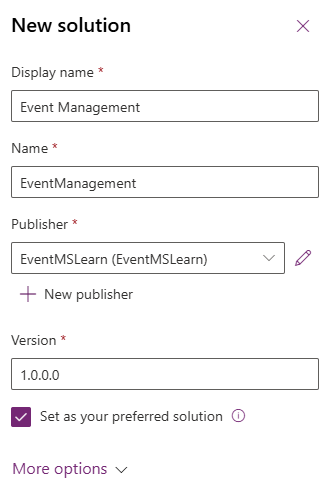

---
lab:
  title: 'Lab 2: Creare una soluzione'
  learning path: 'Learning Path: Manage the Microsoft Power Platform environment'
  module: 'Module 1: Describe Microsoft Dataverse'
---

## Obiettivo di apprendimento

In questo esercizio si creerà una soluzione Power Platform per archiviare i diversi componenti compilati. In Power Platform le soluzioni vengono usate per raggruppare componenti diversi e per garantire la trasportabilità. La soluzione creata in questo esercizio verrà usata nel resto del corso.

### Scenario

Contoso Consulting è un'organizzazione di servizi professionali specializzata in servizi di consulenza IT e di intelligenza artificiale. Durante tutto l'anno, offrono molti eventi diversi ai loro clienti. Alcuni di questi sono eventi di stile di fiera in cui hanno molti partner sono disponibili e forniscono dettagli su nuovi prodotti, tendenze di mercato e servizi. Altri si verificano durante tutto l'anno e sono webinar rapidi che vengono usati per fornire dettagli sui singoli prodotti.

Contoso vuole usare Power Platform per creare una soluzione di gestione eventi che può usare per gestire i diversi eventi che ospitano durante l'anno.

In questo esercizio si creerà una soluzione che verrà usata per la gestione del ciclo di vita delle applicazioni e per raggruppare tutte le diverse app, siti e flussi creati insieme in modo che possano essere facilmente gestiti e trasportati.

Il tempo stimato per completare questo esercizio è **compreso tra 15 e 20** minuti.

Al termine di questo esercizio, si eseguiranno le operazioni seguenti:

- Creare una soluzione di gestione eventi
- Aggiungere le tabelle Account e Contact esistenti alla soluzione.
- Creare una nuova tabella denominata Eventi dall'interno della soluzione.

## Attività 1: Creare una soluzione di gestione eventi

1.  Apri [Power Apps Maker Portal](https://make.powerapps.com).
2.  Passare a **Soluzioni**.
3.  Sulla barra dei comandi selezionare **Nuova soluzione.**
4.  Nella schermata della nuova soluzione configurare come segue:
    - **Nome visualizzato:** Gestione eventi
    - **Nome:** Gestione eventi
5.  In **Server di pubblicazione** selezionare **+ Nuovo server di pubblicazione**
6.  Configurare il nuovo server di pubblicazione come indicato di seguito
    - **Nome visualizzato:** EventMSLEventMSLearnarn
    - **Nome:** EverntMSLearn
    - **Prefisso:** mslearn
    - **Prefisso del valore di scelta:** lasciare il valore predefinito

7.  Selezionare il **pulsante Salva** per salvare l'autore.
8.  **Nel campo Server di pubblicazione** selezionare l'editore **EventMSlearn** appena creato.
9.  Selezionare **Imposta come soluzione** preferita.

10.  Selezionare **Crea**.

## Attività 2: Aggiungere componenti esistenti a una soluzione.

Ora che è stata creata una soluzione per l'archiviazione dei componenti, verranno aggiunte alcune tabelle esistenti. Verranno aggiunte le tabelle Account e Contatto, in modo che possano essere usate facilmente nelle diverse app, flussi e siti di Gestione eventi. Prima di tutto, aggiungeremo la tabella Account alla soluzione.

1.  Se necessario, passare alla **soluzione Gestione** eventi creata nell'attività precedente.
2.  Sulla barra** dei **comandi selezionare **Aggiungi esistente.**
3.  Dal menu visualizzato selezionare **Tabella**.
4.  Selezionare la **tabella Account** , quindi selezionare **Avanti.**
5.  Nella **schermata Seleziona tabelle** selezionare **Includi tutti gli oggetti.**
6.  Seleziona **Aggiungi**

Ora che è disponibile la tabella Account, aggiungeremo la tabella dei contatti.

7.  Sulla barra dei **comandi selezionare di nuovo** il **pulsante Aggiungi esistente**.****
8.  Dal menu visualizzato selezionare **Tabella.**
9.  Selezionare la **tabella Contatto** , quindi selezionare **Avanti.**
10.  Nella **schermata Seleziona tabelle** selezionare **Includi tutti gli oggetti**
11.  Seleziona **Aggiungi**

Congratulazioni, è stata creata una nuova soluzione usando Microsoft Power Platform. Si continuerà a usare la soluzione per aggiungere altri componenti.
