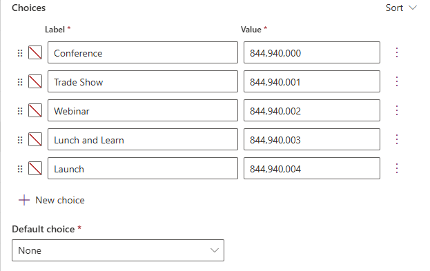

---
lab:
  title: 'Lab 3: Creare un modello di dati'
  learning path: 'Learning Path: Manage the Microsoft Power Platform environment'
  module: 'Module 1: Describe Microsoft Dataverse'
---

## Obiettivo di apprendimento

In questo esercizio gli studenti usano Copilot per creare un modello di dati. Si fornirà una descrizione del tipo di tabelle da compilare e si userà la finestra di progettazione per apportare modifiche in base alle esigenze, ad esempio l'aggiunta di colonne aggiuntive.

Al termine di questo lab, si eseguiranno le operazioni seguenti:

- Usare Copilot per facilitare la creazione di un modello di dati.
- Aggiungere e modificare colonne alle tabelle.

### Scenario

Contoso Consulting è un'organizzazione di servizi professionali specializzata in servizi di consulenza IT e di intelligenza artificiale. Durante tutto l'anno, offrono molti eventi diversi ai loro clienti. Alcuni di questi sono eventi di stile di fiera in cui hanno molti partner sono disponibili e forniscono dettagli su nuovi prodotti, tendenze di mercato e servizi. Altri si verificano durante tutto l'anno e sono webinar rapidi che vengono usati per fornire dettagli sui singoli prodotti.

Contoso vuole usare Power Platform per creare una soluzione di gestione eventi che può usare per gestire i diversi eventi che ospitano durante l'anno.

In questo esercizio si creerà una modalità dati che verrà usata per archiviare i diversi tipi di eventi, registrazioni di eventi e altri dati necessari per Contoso per gestire efficacemente gli eventi.

### Dettagli lab

Prima di iniziare questo esercizio, è consigliabile aver completato:

- **Lab 2: Creare una soluzione Power Platform**

> [!IMPORTANT]
> Questo lab usa l'intelligenza artificiale per compilare i componenti. Poiché i risultati dell'intelligenza artificiale possono variare, è importante notare che i risultati possono essere diversi (ma simili) a quanto definito nel lab. I concetti di base descritti nel lab saranno gli stessi indipendentemente da ciò che è stato creato o da quello che è stato denominato. Se le tabelle e le colonne non corrispondono esattamente, potrebbe essere necessario adattarsi a ciò che è stato creato automaticamente.

### Intervallo lab

Il tempo stimato per completare questo esercizio è **compreso tra 20 e 30** minuti.

> [!NOTE]
> Nel lab precedente è stata creata una soluzione gestione eventi e la si è impostata come soluzione preferita in questo ambiente. Per questo motivo, non è necessario passare direttamente alla soluzione per creare il modello di dati. Gli elementi creati verranno aggiunti automaticamente alla soluzione.

## Attività 1: Creare un modello di dati

Contoso attualmente archivia le informazioni di contatto del doner nell'istanza di Dataverse. Vogliono usare Dataverse per tenere traccia delle concessioni che stanno chiedendo e donazioni ricevute. È necessario creare le tabelle necessarie per supportare le esigenze future dell'applicazione di Contoso.

1.  Se necessario, aprire un Web browser e passare al portale di [Power Apps](https://make.powerapps.com/) Maker e Accedere usando le credenziali dell'account Microsoft.
2.  Dalla barra di spostamento a sinistra selezionare **Tabelle**.
3.  In **Tabelle** selezionare **Introduzione a Copilot**.
4.  **Nella schermata Descrivere le tabelle da compilare** con copilot immettere: "*Creare una tabella per la gestione degli eventi. La tabella deve identificare il nome dell'evento, i dati dell'evento, il numero massimo di partecipanti e i dettagli dell'evento".*
5.  Accanto al **pulsante Genera** selezionare **Impostazioni** tabella e configurare come segue:
    - **Opzioni tabella:** una tabella
    - Non **** includere relazioni.

6.  Selezionare il pulsante **Genera**.

> [!IMPORTANT]
> Copilot deve creare una sola tabella denominata Eventi. Se sono stati creati altri elementi, è possibile eliminarli indicando a Copilot il nome della tabella da eliminare.

**Modificare il modello di dati con Copilot**

Ora che è stata creata la tabella, verranno aggiunte alcune colonne aggiuntive. Si inizierà aggiungendo una colonna del tipo di evento. Inoltre, i contatti parteciperanno ai nostri eventi. Si vuole aggiungere la tabella Contact esistente al modello di dati e associarla a Registrazioni eventi in un secondo momento.

1.  **Nel campo Cosa si desidera eseguire nex**t immettere: "*Aggiungi una colonna di scelta denominata tipo di evento"*
2.  Aggiungere un'altra colonna immettendo il testo seguente: "*Aggiungere una colonna di scelta denominata registration required*"

Aggiungere quindi la **tabella Contact** al modello di dati.

3.  Nella barra** dei **comandi nella parte superiore selezionare **+ Tabella esistente.**
4.  **Nel campo Cerca** immettere **Contatto** e scegliere **Aggiungi selezionato**.

A seconda del tipo di evento, potrebbero essere presenti una o più sessioni. Per gestire le diverse sessioni, è necessario definire il contenuto della sessione e l'evento a cui è associato. Successivamente si userà Copilot per creare una tabella Sessioni di eventi.

5.  **Nel campo What would you like to do next** field, Enter: "*Add a new table called event session".*

Copilot creerà probabilmente due tabelle, Sessione eventi e Relatore eventi. Poiché i contatti saranno relatori, verrà rimossa la tabella del relatore dell'evento.

6.  Se necessario, nel **campo What would you like to do next** (Cosa si vuole fare) immettere: "*Remove the Event Speaker table".*
7.  In Copilot immettere il testo seguente: "*Aggiungere una nuova colonna di testo alla tabella sessione eventi denominata descrizione sessione".*

Successivamente, verrà aggiunta un'ultima tabella denominata Registrazioni sessione. Questa tabella verrà usata per gestire i singoli utenti che eseguono la registrazione per sessioni specifiche.

8.  In Copilot immettere il testo seguente: *"Aggiungere una nuova tabella denominata registrazioni di sessione".*

    Copilot creerà probabilmente due tabelle, Registrazione sessione, Sessione o Partecipante. Poiché i contatti possono essere partecipanti, verrà rimossa la tabella Partecipante. Se sono state create altre tabelle (ad esempio Sessione) diverse dalla registrazione della sessione, rimuoverle.

9.  In Copilot immettere il testo seguente: "*Rimuovi la tabella Partecipante".*
10.  In Copilot immettere il testo seguente: "*Aggiungere una colonna di testo alla tabella di registrazione della sessione denominata istruzioni speciali".*

Ora si creeranno relazioni tra le diverse tabelle. Poiché i record di contatto possono essere relatori nelle sessioni, creeremo una relazione tra le tabelle Contact e Event Session.

11.  Sulla barra dei comandi selezionare **Crea relazioni**.
12.  Configurare la relazione come segue:
    - **Tipo di relazione:** Uno-a-molti
    - **Uno:** Contatto
    - **Molti:** Sessione eventi
    - **Nome visualizzato:** Altoparlante
13.  Selezionare **Fatto**.

Poiché i contatti possono essere registrati per le sessioni nelle sessioni, verrà creata una relazione tra le tabelle Contact e Session Registration.

14.  Sulla barra dei **comandi selezionare **Crea relazioni**.**
15.  Configurare la relazione come segue:
    - **Tipo di relazione:** Uno-a-molti
    - **Uno:** Contatto
    - **Molti:** Registrazione sessione
    - **Nome visualizzato:** Partecipante

16.  Selezionare **Fatto**.

A un singolo evento possono essere associate più sessioni, quindi verrà creata una relazione tra le tabelle Event e Event Session.

17.  Sulla barra dei **comandi selezionare **Crea relazioni**.**
18.  Configurare la relazione come segue:
    - **Tipo di relazione:** Uno-a-molti
    - **Uno:** Evento
    - **Molti:** Sessione eventi
    - **Nome visualizzato:** Evento

Infine, i partecipanti si registrano per sessioni di eventi, quindi sarà necessario creare una relazione tra le tabelle Sessioni eventi e Registrazioni di sessione.

19.  Sulla barra dei **comandi selezionare **Crea relazioni**.**
20.  Configurare la relazione come segue:
    - **Tipo di relazione:** Uno-a-molti
    - **Uno:** Sessione eventi
    - **Molti:** Registrazioni di sessione
    - **Nome visualizzato:** Sessione eventi

21.  Selezionare **Fatto**.

Il modello di dati appena creato dovrebbe essere simile all'immagine:

22.  Selezionare **Salva e esci.**

## Attività 2: Modificare direttamente tabelle e colonne

Copilot è un modo meraviglioso per creare tabelle e colonne molto rapidamente. In alcuni casi, tuttavia, potrebbe essere necessario apportare modifiche direttamente alle tabelle e alle colonne. Ad esempio, in questa attività verranno aggiornate alcune colonne esistenti, nonché tenere traccia del numero di partecipanti registrati per una sessione specifica.

1.  Se necessario, aprire un Web browser e passare al portale di [Power Apps](https://make.powerapps.com/) Maker e Accedere usando le credenziali dell'account Microsoft.
2.  Dalla barra di spostamento a sinistra selezionare **Tabelle**.
3.  **Nel campo Cerca** immettere **Event**.
4.  Aprire la **tabella Event** .
5.  Nell'intestazione **Schema** selezionare **Colonne**.
6.  Individuare e aprire la **colonna Tipo di** evento.
7.  Sostituire le etichette con quanto segue:
    - Conferenza
    - Webinar
    - Pranzo e apprendimento
    - Launch
8.  Impostare l'opzione **** Predefinita su **Nessuno**.

9.  Selezionare il pulsante **Salva**. Se* la colonna non riesce a salvare, la prima volta riprovare.*

Verrà quindi aggiunta una nuova colonna alla **tabella Sessione** eventi per tenere traccia del numero totale di registrazioni di sessione.

10.  Dalla barra di spostamento a sinistra selezionare **Tabelle**.
11.  **Nel campo Cerca** immettere **Event**.
12.  Aprire la **tabella Sessione** eventi.
13.  Nell'intestazione **Schema** selezionare **Colonne**.
14.  Sulla barra dei comandi selezionare il **pulsante Nuova colonna** .
15.  Configurare la nuova colonna come indicato di seguito:
    - **Nome visualizzato:** Registrazioni totali
    - **Tipo di dati:** Numero intero
    - **Comportamento**: Rollup

16.  Selezionare **Salva e modifica**.

> [!IMPORTANT]
> Se il blocco popup è attivato, potrebbe essere necessario disattivarlo per visualizzare il campo di rollup.

17.  Configurare la colonna di rollup come indicato di seguito:
    - In **Entità** correlata selezionare **Aggiungi entità** correlata.
    - Scegliere la **tabella Registrazione sessione** .
    - Selezionare il **pulsante Salva modifiche** (*segno di spunta*)
    - In **Aggregazione** selezionare **Aggiungi aggregazione**.
    - In **Funzione** di aggregazione scegliere **Conteggio**.
    - Per Campo **Entità** correlata aggregata selezionare **Registrazione** sessione.
    - Selezionare il **pulsante *Salva modifiche** (segno di spunta)*

18.  Selezionare il pulsante **Salva e chiudi**.

Le tabelle e le colonne sono state create correttamente in Microsoft Dataverse usando Copilot.
