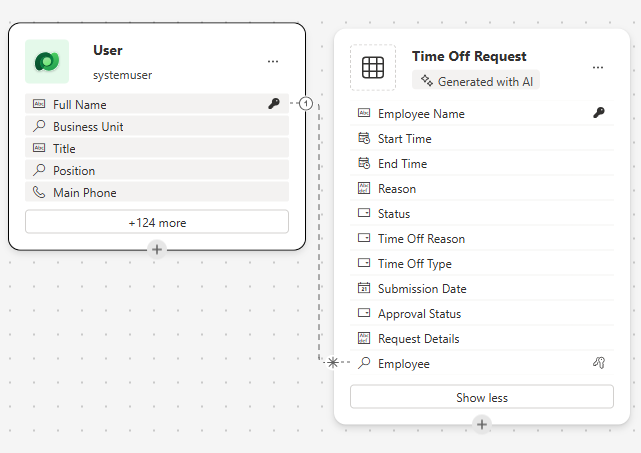
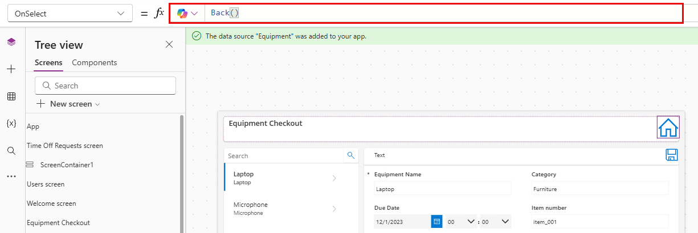

---
lab:
  title: 'Lab 4: Creare un''app canvas'
  learning path: 'Learning Path: Demonstrate the capabilities of Microsoft Power Apps'
  module: 'Module 2: Build a canvas app'
---
## Obiettivo di apprendimento

In questo esercizio si userà Copilot per creare un'applicazione canvas che i dipendenti possono usare per richiedere e gestire le richieste di time off e checkout delle apparecchiature. Dopo aver creato l'app, si userà Copilot e la finestra di progettazione di Power Apps per modificare l'app.

Al termine di questo lab, si eseguiranno le operazioni seguenti:

- Usare Copilot per facilitare la creazione di un modello di dati per supportare l'app.
- Modificare un'applicazione canvas.

### Scenario

Contoso Consulting è un'organizzazione di servizi professionali specializzata in servizi di consulenza IT e di intelligenza artificiale. Stanno cercando di creare un'applicazione di time off che i dipendenti possono usare per richiedere il time off.

### Dettagli lab

Prima di iniziare questo esercizio, è necessario aver completato il lab seguente:

- **Lab 1: creare una soluzione con Progettazione piani**

> [!IMPORTANT]
> Questo lab usa l'intelligenza artificiale per compilare i componenti. Poiché i risultati dell'intelligenza artificiale possono variare, è importante notare che i risultati possono essere diversi (ma simili) a quanto definito nel lab. I concetti di base descritti nel lab saranno gli stessi indipendentemente da ciò che è stato creato o da quello che è stato denominato. Se le tabelle e le colonne non corrispondono esattamente, potrebbe essere necessario adattarsi a ciò che è stato creato automaticamente.*

**Le immagini per questo lab [sono disponibili qui](https://myriumtechsolutions-my.sharepoint.com/:f:/p/derik_bormann/EnSzkatV6HlPvJBFUM8G6xkBd9flg9PfhBDKFW-yDZfPuw?e=v40ti4):**

Il tempo stimato per il completamento di questo esercizio è **compreso tra 45 e 60** minuti.

## Attività 1: Accedere a Power Apps ed esplorare l'interfaccia

1.  Aprire un Web browser e passare al portale di [Power Apps](https://make.powerapps.com/) Maker.
2.  Usando lo spostamento a sinistra, selezionare **Crea**.
3.  In **Crea app** scegliere **Inizia con Copilot**.
4.  Nella schermata **Descrivere le tabelle che si vuole creare da copilota** digitare: " Archiviare le richieste di time off inviate dai dipendenti. La tabella deve identificare l'ora di inizio e di fine della richiesta".
5.  Selezionare il **pulsante Opzioni tabella** . Dal menu visualizzato selezionare **Una tabella**.

6.  Selezionare il pulsante **Genera**.

È necessario che Copilot abbia creato una **tabella richiesta** di time off. Successivamente, verranno aggiunte altre colonne alla tabella.

7.  **Nel riquadro Copilot** immettere: *"Aggiungi una colonna di scelta denominata Time Off Reason".*
8.  **Nel riquadro Copilot** aggiungere singolarmente le istruzioni seguenti.
    - *"Aggiungi una colonna di scelta denominata Time off Type".*
    - *"Aggiungi una colonna Data denominata Data invio".*
    - *"Aggiungere una colonna di scelta alla tabella delle richieste Time Off denominata Stato approvazione".*
    - *"Aggiungere una colonna di testo a più righe denominata Dettagli richiesta".*

    La tabella di time off dovrebbe essere simile all'immagine:

Si aggiungerà quindi la tabella utente al modello di dati in modo da poter associare le richieste di time off a utenti specifici.

9.  Sulla barra** dei **comandi selezionare **+ Tabella** esistente.
10.  Passare da **Ricommed** a **Tutte le tabelle**.
11.  Nel campo Cerca immettere User.In the **Search** field, enter **User**.
12.  Selezionare la **tabella User (Utente)** e fare clic sul **pulsante Add Selected (Aggiungi selezionato** ).
13.  Sulla barra dei **comandi selezionare **Crea relazioni**.**
14.  Configurare la relazione come segue:
    -   **Uno:** Utente
    -   **Molti:** Time Off Request
    -   **Nome visualizzato:** Richiesta di dipendente
15.  Selezionare **Fatto**.

Il modello di dati completato dovrebbe essere simile all'immagine seguente:

16.  Selezionare il **pulsante Salva e apri app** .

> [!NOTE]
> La creazione della nuova app può richiedere alcuni minuti.

## Attività 2: Personalizzare la nuova app

Ora che la nuova app è stata creata, verranno apportate alcune modifiche in base alle proprie esigenze. Inizieremo apportando alcune modifiche alla schermata iniziale.

1.  Con la nuova app aperta, selezionare il **segnaposto Immagine** sopra il **testo** Time Off Requests (Time Off Requests**).**
2.  Dal menu visualizzato selezionare **Modifica **** \> caricamento.**
3.  Scegliere l'immagine **Time off** nella cartella dei file di classe e quindi selezionare **Apri**.
4.  Selezionare quindi il **segnaposto Immagine** sopra **Utenti**.
5.  Dal menu visualizzato selezionare **Modifica **** \> caricamento.**
6.  Scegliere l'immagine **Employee** nella cartella dei file di classe e quindi selezionare **Apri**.

Successivamente, si modificheranno le dimensioni delle immagini per renderle più facili da leggere agli utenti. Inoltre, si modificherà il testo visualizzato per ogni elemento.

7.  Sulla barra dei **comandi selezionare il **pulsante Proprietà**.** (*Situato a destra del pulsante Modifica.*
8.  Selezionare l'immagine **Time off** aggiunta in precedenza.
9.  **Nel pannello Proprietà** configurare l'immagine nel modo seguente:
    -   **Posizione immagine:** Riempimento
    -   **Larghezza:** 300
    -   **Altezza:** 300
10.  Ripetere il passaggio precedente per impostare altezza **** e **larghezza** dell'immagine **Dipendente** su **300** x **300**.
11.  Selezionare il testo seguente **Time Off Requests (Richieste** di time off).
12.  **Nel pannello Proprietà** selezionare il **campo Testo** e modificare il testo in: *"Crea, Visualizza e Gestisci le richieste di time off".*
13.  Selezionare il **testo della schermata** iniziale nell'intestazione****.
14.  **Nel riquadro Proprietà** a destra selezionare il **campo Logo**.
15.  Dal menu visualizzato selezionare **Carica**.
16. Selezionare Contoso Logo** nei file di **classe e selezionare **Apri**.
17. **Nel pannello Proprietà** sotto il **gruppo Stile** e tema selezionare l'icona **Colore riempimento**.
18. Selezionare la **scheda Personalizzata**
19. Modificare il colore esadecimale **** in: **101E2B**
20. Assicurarsi di avere **ancora selezionato Intestazione** e modificare il **titolo** in Contoso Employee Hub

L'app sarà simile all'immagine.

## Attività 3: Aggiungere una nuova schermata all'app.

Mentre stai creando l'app, uno dei tuoi manager ti raggiunge e ti chiede se i dipendenti potrebbero anche usare questa app per controllare le apparecchiature. Contoso sta già archiviando le informazioni di checkout delle apparecchiature in Dataverse, quindi è solo una questione di rendere disponibili le informazioni nell'app.

1.  Con l'app ancora aperta, se necessario, espandere il **riquadro Copilot** . In Copilot immettere quanto segue: "*Aggiungi una nuova schermata denominata Checkout attrezzature".*  Selezionare **Send**.*
2.  Selezionare il **pulsante Mantieni** per accettare la schermata.
3.  Una nuova schermata denominata **Equipment Checkout** viene aggiunta all'app.
4.  **Nella schermata Checkout** attrezzature fare clic su **Con layout** e scegliere il **layout della barra** laterale.
5.  Espandere i diversi contenitori fino a **quando SideBarContainer** non è visibile **.**

6.  Fare clic con il pulsante destro del mouse su **SidebarContainer** e rinominare **EquipContainer1**.
7.  Con il **contenitore EquipContainer1** selezionato, fare clic sul **pulsante Apri menu** Inserisci.
8.  **Nella finestra Cerca** immettere **Raccolta** e selezionare **Raccolta** verticale.
9.  **Nel campo Cerca** immettere **Apparecchiature** e selezionare la **tabella Apparecchiature**.
10. In **Visualizzazione** albero sul lato sinistro della schermata selezionare il **controllo Gallery1** appena aggiunto.
11. Fare clic con il pulsante destro del mouse sul nome della raccolta, scegliere **Rinomina** e rinominare **Elenco attrezzature**.
12. Passare il puntatore del **mouse sulla raccolta Equipment List** , sulla barra degli strumenti visualizzata sopra la raccolta selezionare **Layout**.
13. Selezionare l'opzione **Titolo e layout** sottotitolo.
14. Con la **raccolta Equipment List** selezionata, nel **riquadro Proprietà** configurare come segue:
    -   **Larghezza:** 360
    -   **Altezza flessibile:** Attivato
    -   **Altezza minima:** 287

Successivamente, verrà aggiunto un contenitore aggiuntivo al **contenitore EquipmentContiner1** per archiviare un controllo di ricerca che verrà usato per filtrare il contenuto della **raccolta Equipment List** .

15.  In **Visualizzazione albero** selezionare **EquipContainer1**.
16.  Passare il puntatore del mouse sul contenitore e selezionare l'icona **Copilot** .
17.  Immettere il testo seguente: "*Inserisci un contenitore orizzontale".*

18.  Selezionare il **pulsante Mantieni** .
19.  Verrà aggiunto un nuovo contenitore nella parte inferiore del **contenitore EquipContainer1** .
20.  **Nella visualizzazione** albero fare clic, tenere premuto e trascinare il nuovo contenitore e posizionarlo sopra la **raccolta Elenco** attrezzature.
21.  Rinominare il contenitore in **EquipSearchContainer.**
22.  Con l'opzione **EquipSearchContainer** selezionata, nel **riquadro Proprietà** configurare come segue:
    -   **Larghezza minima:** 0
    -   **Altezza flessibile:** Disattivato
    -   **Altezza:** 44
23.  Con **EquipSearchContainer** selezionato, selezionare il **pulsante Apri menu** Inserisci.
24. **Nel campo Cerca** immettere **Testo** e selezionare **Input di** testo.
25. Rinominare il **campo Input** di testo in **EquipSearchInput**.
26. Con **EquipSearchInput** selezionato, nel **riquadro Proprietà** configurare come segue:
    -   **Impostazione predefinita:** vuoto (niente)
    -   **Testo del suggerimento:** Ricerca
    -   **Tipo di carattere:** Apri sans
    -   **Dimensioni carattere:** 14
    -   **Padding**
        -   **Top:** 5
        -   **Inferiore:** 5
        -   **A sinistra:** 12
        -   **Diritto:** 5
    -   **Altezza:** 44
    -   **Larghezza flessibile:** Attiva
    -   **Larghezza minima:** 0

        

27. In **Visualizzazione** albero selezionare **EquipSearchContainer.**
28. Passare il puntatore del mouse sul contenitore, selezionare l'icona **copilota** e immettere *"Aggiungi un'icona di ricerca".*
29. Selezionare **Mantieni**.
30. Con l'icona **Cerca** selezionata, nel **riquadro Proprietà** configurare il controllo come indicato di seguito:
    -   **Padding**
        -   **Top:** 10
        -   **Botton:** 10
        -   **Sinistra:** 10
        -   **Destra:** 10
    -   **Altezza:** 44
    -   **Larghezza:** 44

31. Usando la **visualizzazione** Albero a sinistra, selezionare **EquipSearchContainer.**
32. **Nel riquadro Proprietà** configurare il contenitore nel modo seguente:
    -   **Larghezza minima:** 0
    -   **Altezza:** 44

Infine, verrà configurata la **raccolta Equipment List** per popolare i dati in base al testo immesso nel campo del controllo di ricerca.

33.  Selezionare la **raccolta Equipment List** creata in precedenza.
34.  **Nella proprietà Items** immettere la formula seguente: Search([@'Equipment'], *EquipSearchInput*. Text, 'Equipment Name',Category)

## Attività 4: Compilare un contenitore per visualizzare le operazioni dei record.

Quando un utente seleziona un record nell'elenco Apparecchiature, si vuole aprire il record in un altro contenitore per consentire loro di modificare il record selezionato.

1.  **Selezionare MainContainer**.
2.  In MainContainer** selezionare il **pulsante Apri menu Inserisci**.**
3.  **In Cerca** file immettere **Contenitore** e scegliere **Contenitore** verticale.
4.  Fare clic con il pulsante destro del mouse e **rinominare** il contenitore in **RecordDetails**.
5.  **Nel contenitore RecordDetails** selezionare il **pulsante di menu** Apri inserimento.
6.  Scegliere Modifica modulo** dal **menu **Inserisci**.
7.  Nella schermata Seleziona origine dati selezionare **Apparecchiature**. *Il popolamento dei dati può richiedere fino a 30 secondi.*
8.  Fare clic con il pulsante destro del mouse sul modulo appena aggiunto e **rinominarlo** in **EquipmentForm**.
9.  **Nel riquadro Proprietà** selezionare la **scheda Avanzate** e impostare la **proprietà Item** su: *'Equipment List'*. Selezionato. *Verrà popolato il form con il record attualmente selezionato.*
10. Selezionare la **scheda Visualizza** e configurare il modulo nel modo seguente:
    -   **Colonne:** 2
    -   **Modalità predefinita:** Modifica

Ora si aggiungerà un altro contenitore che verrà usato per controllare le operazioni nel form.

11.  Assicurarsi di avere **selezionato MainContainer** .
12.  Selezionare l'icona **Copilot** visualizzata. Immettere quanto segue: *"Inserisci un contenitore orizzontale".*
13.  Selezionare **Mantieni**.
14.  Fare clic con il pulsante destro del mouse sul contenitore e **rinominarlo** **in SelectedRecord1**
15.  Usando **la visualizzazione Albero** , spostare il **contenitore SelectedRecord1** sopra il **contenitore RecordDetails** .
16.  Configurare il **contenitore SelectedRecord1** come indicato di seguito:
    -   **Larghezza minima:** 250
    -   **Altezza flessibile:** Disattivato
    -   **Height**: 50
17.  Con il **contenitore SelectedRecord1**selezionato, selezionare il **pulsante Apri inserisci menu** .
18.  Selezionare **Etichetta testo.**
19.  **Rinominare l'etichetta in** SelectedRecordTitle
20. Selezionare **Mantieni**.
21. **Configurare SelectedRecordTitle** come indicato di seguito:
    1.  **Padding**
        1.  **Top:** 5
        2.  **Inferiore:** 5
        3.  **Sinistra:** 30
        4.  **Altezza:** 40
    2.  **Larghezza flessibile:** Attiva
    3.  **Larghezza minima:** 150
22. Selezionare il **contenitore SecondRecord1** , selezionare il **pulsante Inserisci** .
23. **Nel campo Cerca** immettere **Salva** e selezionare l'icona **Salva**.
24. Configurare il **pulsante Salva** come indicato di seguito:
    -   **Altezza:** 40
    -   **Width**: 40
25. Selezionare la **proprietà OnSelect** e immettere la formula seguente. SubmitForm(EquipmentForm).

## Attività 5: Modificare l'intestazione nella pagina

L'ultimo passaggio della creazione di questa schermata consiste nel popolare il contenitore reader con i dati.

1.  **Selezionare HeaderContainer** nella parte superiore dell'app.
2.  Selezionare il **pulsante Apri menu** Inserisci.
3.  Selezionare **Etichetta di testo**.
4.  Configurare il **controllo Etichetta di testo** come indicato di seguito:
    -   **Testo:** Checkout attrezzature
    -   **Tipo di carattere:** Apri sans
    -   **Dimensioni carattere:** 16
    -   **Spessore del carattere:** Semibold
        -   **Spaziatura interna:** 16
        -   **Inferiore:** 16
        -   **A sinistra:** 16
        -   **Diritto:** 16
    -   **Altezza:** 40
    -   **Larghezza flessibile:** Attiva

        

5.  **Selezionare HeaderContainer**, scegliere **Inserisci** e selezionare l'icona**** Home.
6.  Impostare la **proprietà OnSelect** del pulsante Home su: Back()

## Attività 6: Completare la configurazione della schermata iniziale

Dopo la revisione, abbiamo deciso che non è necessario avere la possibilità di creare utenti in questa app, quindi cambieremo la schermata di benvenuto per consentire di accedere al checkout delle attrezzature.

7.  Usando **la visualizzazione** Albero, selezionare la **schermata iniziale**.
8.  Selezionare l'immagine **** precedente **Utenti**.
9.  Dal menu visualizzato selezionare **Modifica** e scegliere **Carica**.
10.  Individuare l'immagine **Apparecchiature** nella cartella degli studenti e scegliere **Apri**.
11.  Impostare la **proprietà OnSelect** dell'immagine su: Navigate(*'Equipment Checkout'*)
12.  Selezionare il **testo Users (Utenti** ) e impostare la **proprietà Text** su **Equipment (Apparecchiature**).
13.  Selezionare il testo sotto Apparecchiature e modificare la proprietà Testo in: Controllare le attrezzature e modificare le prenotazioni.Select the **Text** below **Equipment** and change the **Text** property to: Check out equipment and edit reservations.

## Attività 7: Testare l'applicazione

1.  Sulla barra dei **comandi selezionare il **pulsante Riproduci**.**
2.  Selezionare l'immagine **Apparecchiature** .
3.  **Nel campo Cerca** immettere **Electronics**. (*Si noti come l'elenco filtra*)
4.  Selezionare il **record Laptop** .
5.  Modificare categoria in **** **Mobili.**
6.  Selezionare il pulsante **Salva**.
7.  Si noti che la categoria del **portatile** cambia in **Mobili**.
8.  Selezionare il **pulsante Home** .
9.  Selezionare Viola X** per lasciare **la **modalità di anteprima**.

## Attività 8: Salvare e pubblicare l'app

**Obiettivo:** salvare e pubblicare l'app per renderla accessibile tra Web browser, dispositivi mobili o piattaforme incorporate come SharePoint o Teams.

1.  In Power Apps Studio selezionare il **pulsante Salva** .
2.  **Nella schermata Salva** con nome impostare Nome** **su **Contoso Employee Hub**, selezionare **Salva**.
3.  Selezionare il pulsante **Pubblica**.
