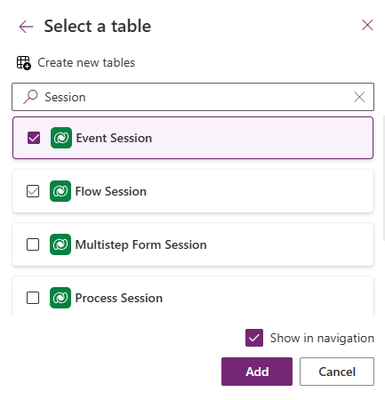
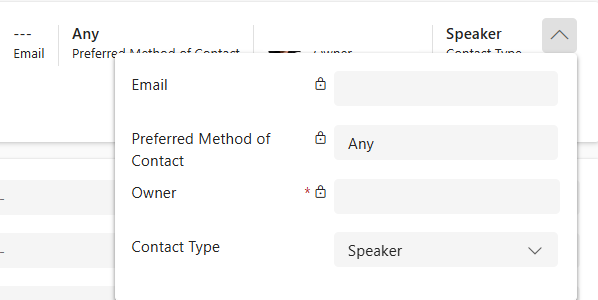

---
lab:
  title: 'Lab 5: Creare un''app basata su modello'
  learning path: 'Learning Path: Demonstrate the capabilities of Microsoft Power Apps'
  module: 'Module 3: Build a model-driven app'
---
## Obiettivo di apprendimento

In questo esercizio gli studenti creeranno un'app basata su modello in Power Apps usando Copilot. Si definirà il modello di dati, si modificheranno moduli e visualizzazioni e si creerà l'applicazione.

**Al termine di questo lab, si eseguiranno le operazioni seguenti:**

-   Creare un'applicazione basata su modello.
-   Modificare moduli e visualizzazioni nell'applicazione in base alle proprie esigenze.
-   Esplorare un'applicazione basata su modello.

### Scenario

Contoso Consulting è un'organizzazione di servizi professionali specializzata in servizi di consulenza IT e di intelligenza artificiale. Durante tutto l'anno, offrono molti eventi diversi ai loro clienti. Alcuni di questi sono eventi di stile di fiera in cui hanno molti partner sono disponibili e forniscono dettagli su nuovi prodotti, tendenze di mercato e servizi. Altri si verificano durante tutto l'anno e sono webinar rapidi che vengono usati per fornire dettagli sui singoli prodotti.

Contoso vuole usare Power Platform per creare una soluzione di gestione eventi che può usare per gestire i diversi eventi che ospitano durante l'anno.

In questo esercizio si creerà un'applicazione basata su modello per gestire gli eventi di Contoso. L'applicazione basata su modello si baserà su un modello di dati esistente e includerà eventi, sessioni di eventi e registrazioni di sessione.

### Dettagli lab:

Prima di iniziare questo esercizio, è consigliabile aver completato:

-   **Lab 2: Creare una soluzione Power Platform**
-   **Lab 3: Creare un modello di dati**

Il tempo stimato per completare questo esercizio è **compreso tra 20 e 30** minuti.

## Attività 1: Creare un modello per supportare la nuova applicazione basata su modello

Contoso archivia attualmente le informazioni di contatto nell'istanza di Dataverse, quindi vuole usare Dataverse per tenere traccia dei corsi e delle registrazioni dei corsi. È necessario creare le tabelle necessarie per supportare l'applicazione e creare un'applicazione basata su modello basata su tale modello di dati.

1.  Se necessario, aprire un Web browser e passare al portale di [Power Apps](https://make.powerapps.com/) Maker e Accedere usando le credenziali dell'account Microsoft.
2.  Usando lo spostamento a sinistra, selezionare **Soluzioni.**
3.  Aprire la **soluzione Gestione** eventi creata in precedenza.
4.  Sulla barra dei comandi selezionare **Nuova** **\> \> **** app basata su modello di app.******
5.  Selezionare la **sezione Crea** .
    -   **Nome:** Gestione eventi Contoso
    -   **Descrizione:** consente di gestire eventi e sessioni di eventi.
6.  Selezionare il **pulsante** Crea**.**
7.  Selezionare il **pulsante Aggiungi pagina** e selezionare **Tabella di dataverse.**
8.  Selezionare le tabelle seguenti:
    -   Contatto
    -   Event
    -   Sessione evento
    -   Registrazione della sessione
9.  Assicurarsi che **l'opzione Mostra nel riquadro di spostamento** sia selezionata.

10. Seleziona il pulsante **Aggiungi**.

> [!NOTE]
> A volte verrà richiesto di accedere durante l'uso della finestra di progettazione. Selezionare la X per annullare la schermata di accesso.

## Attività 2: Modificare l'applicazione basata su modello in base alle proprie esigenze

Ora che l'app viene creata, verranno apportate alcune modifiche alla modalità di presentazione dell'applicazione. Dobbiamo avere due gruppi distinti; Persone ed eventi. Si vuole avere la tabella Contatti nel gruppo People e tutte le tabelle Event nel gruppo Eventi.

1.  In **Navigazione** sul lato sinistro della schermata selezionare **Nuovo gruppo**.
2.  Sul lato destro dell'applicazione espandere il **pannello Proprietà** .
3.  Modificare il **titolo** da **Nuovo gruppo** a **Persone.**

    

4.  Selezionare i **puntini di sospensione** nel **gruppo Persone** .
5.  Scegliere **Nuovo gruppo**.
6.  **Nel riquadro Proprietà** modificare il nome del gruppo da **Nuovo gruppo** a **Eventi.**
7.  Passare il puntatore del mouse sulla **visualizzazione** Registrazioni sessione a sinistra, selezionare i **puntini di sospensione** e scegliere **Sposta giù** per spostare **le registrazioni** delle sessioni nel **gruppo Eventi** .
8.  Passare il puntatore del mouse sulla **visualizzazione Sessioni** eventi a sinistra, selezionare i **puntini di sospensione** e scegliere **Sposta giù** per spostare **le sessioni** eventi nel **gruppo Eventi** .
9.  Passare il puntatore del mouse sulla **visualizzazione** Eventi a sinistra, selezionare i **puntini di sospensione** e scegliere **Sposta verso il basso** per spostare **gli eventi nel **gruppo** Eventi**.

L'app dovrebbe essere simile all'immagine:

## Attività 3: Modificare i diversi moduli e visualizzazioni nell'applicazione basata su modello in base alle proprie esigenze.

L'applicazione model drive usa moduli e visualizzazioni per presentare i dati agli utenti nell'interfaccia utente. Verranno apportate alcune modifiche a tali elementi.

1.  Se necessario, assicurarsi che **l'app Contoso Event Management** sia aperta nella finestra di progettazione.
2.  Sul lato sinistro della schermata, sotto il gruppo Persone** passare il **puntatore del mouse sul **modulo** Contatti e selezionare **Modifica.**

    Se viene richiesto di salvare le modifiche, selezionare **Salva e continua.**

3.  In **Colonne** tabella a sinistra selezionare **Nuova colonna** tabella.
4.  Configurare la colonna della tabella come indicato di seguito:
    -   **Nome visualizzato:** Tipo di contatto
    -   **Tipo di dati:** Scelta
    -   **Eseguire la sincronizzazione con la scelta globale:** No
5.  Impostare Etichetta **** della prima scelta su **Altoparlante.**
6.  Selezionare **+ Nuova scelta** e impostare l'etichetta su **Partecipante.**
7.  Selezionare **+ Nuova scelta** e impostare l'etichetta su **Staff di** supporto.

8.  Selezionare il pulsante **Salva**.
9.  Usando il mouse, selezionare il **testo Nuovo contatto** per selezionare l'intestazione del modulo. *(Dovrebbe essere visualizzato un rettangolo viola intorno all'intestazione)*
10. In **Colonne** tabella immettere Contatto** nel **campo **Cerca**.
11. Selezionare la **colonna della tabella Contact Type** appena creata.
12. Il **tipo di** contatto dovrebbe ora essere visualizzato nell'intestazione****.

13. Sulla barra** dei comandi dei moduli **selezionare il **pulsante Salva e pubblica**.
14. Selezionare il **pulsante Freccia Indietro** per tornare alla finestra di progettazione di applicazioni basate su modello
15. In **Navigazione** a sinistra passare il puntatore del mouse sulla **visualizzazione** Contatti e selezionare l'icona **Modifica** .
16. Selezionare **+ Visualizza colonna**.
17. Cercare e aggiungere la **colonna Tipo contatto** al modulo.
18. Selezionare il pulsante **Salva e pubblica**.

Successivamente, verranno apportate le modifiche necessarie ai moduli rimanenti.

19.  In **Navigazione** selezionare **Visualizzazione** eventi.

Si noti che potrebbe essere presente una **colonna EventDetails1** . In tal caso, verrà rimosso dalla visualizzazione. *(Se non ce l'hai,* **è possibile passare al passaggio 28**)*

20.  Passare il puntatore del mouse sulla **visualizzazione** Eventi e selezionare il **pulsante Modifica** .

Se viene richiesto di **salvare** le modifiche, selezionare **Salva e continua**.

21.  **Nella visualizzazione** selezionare la freccia accanto a **EventDetails1** e scegliere Rimuovi** dal menu visualizzato**.

22.  Selezionare il pulsante **Salva e pubblica**.
23.  Selezionare il **pulsante Freccia Indietro** per tornare alla finestra di progettazione dell'app.
24.  In **Navigazione** passare il puntatore del mouse sul **modulo** Eventi** **e selezionare **Modifica**.

    Se viene richiesto di salvare le modifiche, selezionare **Salva e continua**.

25.  Selezionare **il campo Dettagli evento1** e premere il **tasto Canc** sulla tastiera.

Il modulo dovrebbe essere simile all'immagine:

26.  Selezionare il **pulsante Salva e pubblica** .
27.  Selezionare il **pulsante Freccia Indietro** per tornare alla finestra di progettazione dell'app.

Se nel modulo non è presente il campo EventDetail1, continuare qui.

28.  **Sulla barra** dei comandi dell'app selezionare il **pulsante Salva e pubblica**.
29.  Selezionare il **pulsante Indietro** per tornare al portale di **Power Apps Maker** .
30.  Selezionare **Torna alle soluzioni** per tornare alla schermata principale **di Power Apps** .

## Attività 4: Testare la nuova applicazione

Ora che l'applicazione basata su modello è stata creata, verrà testata la relativa funzionalità.

Prima di tutto aggiungeremo un paio di contatti.

1.  Usando lo spostamento a sinistra, selezionare **App**.
2.  Modificare le app visualizzate da **App personali** a **Tutte**.
3.  Passare il mouse sull'applicazione **Course Event Management** appena creata e selezionare l'icona **Riproduci** .
4.  Usando lo spostamento a sinistra, selezionare **Contatti**.
5.  Sulla barra dei comandi selezionare il **pulsante + Nuovo** .
6.  Nella **schermata Nuovo contatto** configurare come segue:
    -   **Nome:** Voice
    -   **Cognome:** Diaz.
    -   **Titolo del lavoro:** Ingegnere
7.  Nell'intestazione del modulo selezionare la freccia giù accanto a **Tipo contatto**.
8.  **Impostare Tipo di** contatto su **Altoparlante**.

9.  Selezionare il **pulsante Salva** per salvare il contatto e lasciarlo aperto.
10. Selezionare il pulsante **+New**.
11. Nella **schermata Nuovo contatto** configurare come segue:
    -   **Nome:** Edgar
    -   **Cognome:** Swenson
    -   **Job Title:** Architect
12. Nell'intestazione del modulo selezionare la freccia giù accanto a **Tipo contatto**.
13. Impostare Tipo **di** contatto su **Partecipante**.
14. Selezionare il pulsante **Salva e chiudi**.

Successivamente, verrà aggiunto un nuovo evento.

15.  Usando lo spostamento a sinistra, selezionare **Eventi**.
16.  Sulla barra dei comandi selezionare il **pulsante + Nuovo** .
17.  Nella **schermata Nuovo evento** configurare come segue:
    -   **Nome evento:** conferenza Spring.
    -   **Data evento:** data di domani.
    -   **Numero massimo partecipanti:** 500
    -   **Dettagli evento:** conferenza Spring per presentare i prodotti e i servizi più recenti dei fornitori supportati.
    -   **Tipo di evento:** Conferenza
    -   **Località:** Seattle
    -   **Registrazione obbligatoria:** Sì/True

18.  Selezionare il pulsante **Salva e chiudi**.

Verrà quindi aggiunta una nuova sessione per l'evento.

19.  Usando lo spostamento a sinistra, selezionare **Sessioni** eventi.
20.  Selezionare il pulsante **+New**.
21.  Configurare la **sessione** eventi come indicato di seguito:
    -   **Nome sessione:** intelligenza artificiale responsabile
    -   **Data sessione:** data di domani
    -   **Durata:** 1,5 ore
    -   **Descrizione sessione:** con tutte le nuove soluzioni di intelligenza artificiale, è importante essere responsabili. Parleremo delle sfide.
    -   **Relatore:** Susan Diaz
    -   **Evento:** Spring Conference

22.  Selezionare il pulsante **Salva e chiudi**.

Infine, creeremo una **registrazione** di sessione.

23.  Usando il riquadro di spostamento a sinistra, selezionare **Registrazioni di sessione.**
24.  Sulla barra dei **comandi selezionare **+ Nuovo**.**
25.  Completare la registrazione della sessione come indicato di seguito:
    -   **Nome:** E, Registrazione Swenson.
    -   **Data registrazione:** data odierna
    -   **Partecipante:** Edgar Swenson
    -   **Sessione:** Mark Jones

26.  Seleziona il pulsante **Salva e chiudi**.
