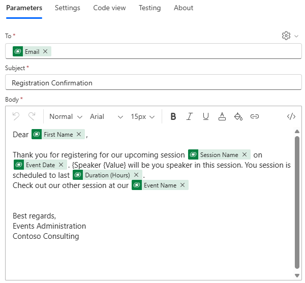

---
lab:
  title: 'Lab 6: Creare un flusso di Power Automate'
  learning path: 'Learning Path: Demonstrate the capabilities of Microsoft Power Automate'
  module: 'Module 2: Build a Microsoft Power Automate flow'
---
## Obiettivo di apprendimento

In questo esercizio gli studenti creeranno una serie di diversi flussi cloud usando Microsoft Copilot in Power Automate. Si useranno metodi di creazione diversi, ad esempio Copilot e da zero, per acquisire familiarità con le diverse opzioni disponibili.

**Al termine di questo esercizio, si eseguiranno le operazioni seguenti:**

- Usare i prompt del linguaggio naturale per progettare i flussi di lavoro
- Configurare trigger e azioni
- Testare l'automazione per un uso pratico.

### Scenario

Contoso Consulting è un'organizzazione di servizi professionali specializzata in servizi di consulenza IT e di intelligenza artificiale. Durante tutto l'anno, offrono molti eventi diversi ai loro clienti. Alcuni di questi sono eventi di stile di fiera in cui hanno molti partner sono disponibili e forniscono dettagli su nuovi prodotti, tendenze di mercato e servizi. Altri si verificano durante tutto l'anno e sono webinar rapidi che vengono usati per fornire dettagli sui singoli prodotti. Inoltre, Contoso sta iniziando a usare agenti automatizzati per assistere i clienti con domande.

Contoso vuole usare Power Automate per creare un flusso di conferma della registrazione che invierà un messaggio di posta elettronica automatizzato a un cliente quando esegue la registrazione per un evento. Inoltre, vogliono creare un flusso che userà l'intelligenza artificiale per fornire risposte generative alle domande dei clienti.

In questo esercizio si creerà una serie di flussi di Power Automate in base a criteri specifici.

Prima di iniziare questo esercizio, è necessario aver completato il lab seguente:

- **Lab 3: Creare un modello di dati**
- **Lab 5: creare un'app basata su modello**

## Esercizio 1: Creare un flusso di notifica di registrazione sessione

In questo primo esercizio si creerà un flusso che verrà eseguito automaticamente quando viene creata una nuova registrazione della sessione. Otterrà i dettagli della sessione, dell'evento e del contatto che ha registrato e inviato un messaggio di posta elettronica a questo con i relativi dettagli di registrazione.

### Attività 1: creare un flusso

Si vuole inviare una conferma di registrazione a tutti gli utenti appena registrati. Verrà creato un flusso che acquisirà i dettagli di una registrazione e invierà un messaggio di posta elettronica di conferma all'utente registrato.

1.  Accedere a <https://make.powerautomate.com>.
2.  Potrebbe essere necessario ripetere l'autenticazione. Selezionare **Accedi** e seguire le istruzioni, se richiesto.
3.  Nella schermata Crea automazione con Copilot immettere: *"Quando viene creata una nuova registrazione di sessione in Dataverse, ottenere i dettagli della sessione e l'evento per cui la registrazione è per inviare un messaggio di posta elettronica di conferma a una persona registrata".*
4.  Copilot suggerisce un potenziale flusso in base alla descrizione.
5.  Dovrebbe essere simile all'immagine seguente:

6.  Selezionare **Mantieni e continua**.
7.  Esaminare le connessioni per assicurarsi che tutto sia corretto.
8.  Seleziona Crea flusso.
9.  Scegliere il trigger **Quando viene aggiunta, modificata o eliminata** una riga.
10. Popolare le condizioni di trigger per il flusso:
    - Selezionare **Aggiunte** per **Tipo di modifica**
    - Selezionare **Registrazioni sessione** per il nome della **tabella**
    - Selezionare **Organizzazione** per **Ambito**
11. Selezionare il testo **Quando viene aggiunta, modificata o eliminata** una riga e rinominare il passaggio **trigger Quando viene aggiunto un report spese.**

Questa è una procedura consigliata, per consentire all'utente e agli altri editor del flusso di comprendere lo scopo del passaggio senza dover esaminare i dettagli.

### Attività 2: Creare un passaggio per ottenere i dettagli della sessione eventi per cui si intende registrare la registrazione.

1.  Selezionare **Recupera una riga in base all'ID** .
2.  Selezionare **Sessioni** eventi come **nome tabella**
3.  Selezionare il campo **ID riga**. Notare che viene visualizzata una finestra per selezionare **Contenuto dinamico** o **Espressioni**.
4.  **Nel campo ID** riga selezionare **Sessione eventi (valore)** dall'elenco **Contenuto** dinamico.
5.  Selezionare il **testo Get a row by ID (Ottieni una riga per ID**) e rinominare questa azione **Get Event Session** (Ottieni** **sessione eventi).

Si otterranno quindi i dettagli dell'evento in cui si trova la sessione.

6.  Selezionare **Recupera una riga in base all'ID 2** passaggio.
7.  Selezionare **Eventi** come **nome tabella**
8.  Selezionare il campo **ID riga**. Notare che viene visualizzata una finestra per selezionare **Contenuto dinamico** o **Espressioni**.
9.  **Nel campo ID** riga selezionare **Evento (valore)** dall'elenco **Contenuto** dinamico.
10.  Selezionare il **testo Get a row by ID (Ottieni una riga per ID** ) e rinominare questa azione **Get Event (Ottieni** **evento**).

Infine, otterremo i dettagli della persona registrata per la sessione.

11.  In Recupera dettagli evento impostare Inserisci **nuova azione**.
12.  Nel campo di ricerca immettere Dataverse.
13.  Selezionare **Recupera una riga per ID**.
14.  Selezionare **Contatti** come **Nome tabella**
15.  Selezionare il campo **ID riga**. Notare che viene visualizzata una finestra per selezionare **Contenuto dinamico** o **Espressioni**.
16.  **Nel campo ID** riga selezionare Partecipante **(valore)** dall'elenco **Contenuto** dinamico.
17.  Selezionare il **testo Get a row by ID (Ottieni una riga per ID** ) e rinominare questa azione **Get Participant Details (Ottieni** **dettagli** partecipante).

### Attività 3: Creare un passaggio per inviare un messaggio di posta elettronica per confermare la registrazione della sessione

1.  Selezionare il **passaggio** Invia messaggio di posta elettronica.
2.  Selezionare l'icona **a forma** di ingranaggio sopra il **campo A** e selezionare **Usa** **valori** dinamici.
3.  Selezionare il **campo A** e usare i valori dinamici, selezionare **Email (Invia messaggio di posta elettronica** ) in **Get Participant Details (Ottieni dettagli** partecipante).
4.  **Nel campo Oggetto** verificare che sia la conferma della registrazione.
5.  Nel **Corpo dell'e-mail**, immettere il testo seguente:

> [!NOTE]
> Il contenuto dinamico deve essere inserito nei campi con nome tra parentesi graffe. È consigliabile copiare e incollare prima tutto il testo e poi aggiungere il contenuto dinamico nelle posizioni corrette.

*Caro {Nome}, grazie per la registrazione per la prossima sessione {Nome sessione} in {Data evento}. Il relatore {Value} sarà il relatore in questa sessione. La sessione è pianificata per l'ultima {Durata (ore)}. Consultare l'altra sessione all'indirizzo {Nome evento}.*

*Migliori saluti*

*Amministrazione eventi*

*Contoso Consulting*

6.  Evidenziare il testo **{First Name}**. Sostituirlo con il **campo Nome** del **passaggio Recupera dettagli** partecipante.
7.  Evidenziare il **testo {Nome sessione}** . Sostituirlo con il **campo Nome** sessione del **passaggio Recupera sessione** eventi.
8.  Evidenziare il **testo {Data evento}** . Sostituirlo con il **campo Data** evento del **passaggio Recupera dettagli** evento.
9.  Evidenziare il **testo {Durata (ore)}** . Sostituirlo con il **campo Durata (ore)** del **passaggio Ottieni sessione** eventi.
10.  Evidenziare il **testo {Nome evento}** . Sostituirlo con il **campo Nome** evento del **passaggio Recupera dettagli** evento.

Il passaggio completato dovrebbe essere simile all'immagine:

11.  Seleziona **Salva**.

Lasciare aperta questa scheda del flusso per l'attività successiva. Il flusso sarà simile al seguente:

### Attività 4: Convalidare e testare il flusso

1.  Aprire una nuova scheda nel browser e passare a https://make.powerapps.com.
2.  Selezionare l'ambiente **Dev One** in alto a destra, se non è già selezionato.
3.  Selezionare **App** e aprire l'app **** Contoso Event Management.
4.  Lasciare aperta questa scheda del browser e tornare alla scheda precedente con il flusso.
5.  Nella barra dei comandi, selezionare **Test**. Selezionare **Manualmente**, quindi selezionare **Test**.
6.  Passare alla scheda del browser con l'app basata su modello aperta.
7.  Usando lo spostamento della mappa della mappa a sinistra, selezionare **Registrazione sessione**.
8.  Selezionare il **pulsante + Nuovo** per aggiungere un nuovo **record di registrazione sessione** .
9.  Completare il record** di registrazione della **sessione come indicato di seguito:
    -   **Nome report:** Report test
    -   **Scopo del report:** Conferenza
    -   **Data di scadenza del report:** domani
10. Selezionare il pulsante **Salva e chiudi**.
11. Passare alla scheda del browser in cui è in esecuzione il test del flusso. Dopo un breve ritardo, dovrebbe essere visualizzato il flusso in esecuzione. Durante questa fase è possibile rilevare eventuali problemi nel flusso o verificare che venga eseguito correttamente.

Dopo un breve ritardo, si dovrebbe ricevere un’e-mail nella casella di posta elettronica.

> [!NOTE]
> Può passare alla cartella Posta indesiderata.

## Esercizio 2: Creare un flusso di risoluzione dei problemi tecnologici

### Attività 1: Creare un flusso di risoluzione dei problemi tecnologici

In questo esercizio si creerà un flusso di Power Automate che verrà eseguito come agente che acquisirà i sintomi e lo userà per diagnosticare il problema della tecnologia.

1.  Aprire [Power Automate**](https://make.powerautomate.com)**.****
2.  Usando lo spostamento a sinistra, selezionare **Crea**.
3.  Selezionare **Flusso cloud automatizzato.**
4.  Selezionare il **pulsante Ignora** .
5.  Selezionare la **casella Aggiungi un trigger** . Cercare e selezionare **Quando un agente chiama il flusso**.
6.  Selezionare **Aggiungi un input**.
7.  Selezionare **Testo** e modificare il nome da **Input** a **Tipo di** dispositivo.
8.  Selezionare **di nuovo Aggiungi un input** , scegliere **Testo** e modificare il nome da **Input** a **Tipo di** problema.
9.  Selezionare **Aggiungi un input** un'ultima volta, scegliere **Testo** e modificare il nome da **Input** a **Descrizione del problema.**

Il trigger completato dovrebbe essere simile all'immagine seguente:

> [!IMPORTANT]
> Se si creasse una tecnologia true sintomo checker, si acquisirebbero più input diversi per aiutare le risposte generate per essere il più accurate possibile. Per questo esercizio viene illustrato come eseguire questa operazione.

#### Come specificare un'azione

1.  **In Quando un agente chiama il trigger di flusso**, selezionare **Inserisci un nuovo passaggio** (+).
2.  Nella finestra aggiungi un'azione cercare e selezionare **Esegui una richiesta**.
3.  Nella finestra Esegui un prompt impostare il campo Prompt su Ai Summarize .In the **Run a prompt** window, set the **Prompt** field to **AI Summarize**.
4.  **Nel campo Testo** di input selezionare l'icona **Dynamics value** *(Lightning bolt).*
5.  In Quando un agente chiama il flusso, selezionare i valori dinamici seguenti:
    -   Tipo di dispositivo
    -   Tipo di problema
    -   Descrizione del problema
6.  **Nel passaggio Esegui un prompt** selezionare **Inserisci un nuovo passaggio (+)**
7.  **Nella finestra Aggiungi un'azione** immettere "Rispondi" e selezionare **Rispondi all'agente**.
8.  Selezionare **Aggiungi un output**.
9.  Seleziona **Testo**.
10. Impostare il nome dell'output su **Testo** riepilogato.
11. **Nel campo Immettere un valore per rispondere con** selezionare **Valore** dinamico (bolt di illuminazione)
12. Cerca e seleziona **Corpo**.

Il passaggio Rispondi all'agente** completato **dovrebbe essere simile al seguente:

13.  Seleziona **Salva**.
14.  Selezionare il pulsante **Test**.
15.  Nel riquadro Flusso** di test **selezionare **Manualmente**.
16.  Selezionare il pulsante **Test**.
17.  Nel riquadro Esegui flusso immettere quanto segue:
    - **Tipo di dispositivo:** PC Windows
    - **Tipo di problema:** Applicazione non risponde
    - **Descrizione del problema:** quando si avvia Microsoft Excel, l'applicazione inizierà a essere caricata, ma si blocca subito dopo la schermata iniziale di Excel. Siede lì e non succede nulla.
18.  Selezionare il **pulsante Esegui flusso** .
19.  Al termine del test, selezionare il passaggio Esegui un prompt. Si noti che tornare alla **scheda Progettazione** .
20.  Seleziona **Pubblica**.
