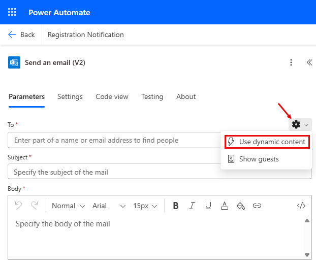

---
lab:
  title: 'Lab 6: Creare un flusso di Power Automate'
  learning path: 'Learning Path: Demonstrate the capabilities of Microsoft Power Automate'
  module: 'Module 2: Build a Microsoft Power Automate flow'
---

## Obiettivo di apprendimento

In questo esercizio gli studenti creeranno una serie di diversi flussi cloud usando Microsoft Copilot in Power Automate. Si useranno metodi di creazione diversi, ad esempio Copilot e da zero, per acquisire familiarità con le diverse opzioni disponibili.

Al termine di questo esercizio, si eseguiranno le operazioni seguenti:

- Usare i prompt del linguaggio naturale per progettare i flussi di lavoro
- Configurare trigger e azioni
- Testare l'automazione per un uso pratico.

### Scenario

Contoso Consulting è un'organizzazione di servizi professionali specializzata in servizi di consulenza IT e di intelligenza artificiale. Durante tutto l'anno, offrono molti eventi diversi ai loro clienti. Alcuni di questi sono eventi di stile di fiera in cui hanno molti partner sono disponibili e forniscono dettagli su nuovi prodotti, tendenze di mercato e servizi. Altri si verificano durante tutto l'anno e sono webinar rapidi che vengono usati per fornire dettagli sui singoli prodotti. Inoltre, Contoso sta iniziando a usare agenti automatizzati per assistere i clienti con domande.

Contoso vuole usare Power Automate per creare un flusso di conferma della registrazione che invierà un messaggio di posta elettronica automatizzato a un cliente quando esegue la registrazione per un evento. 

In questo esercizio si creerà una serie di flussi di Power Automate in base a criteri specifici.

Prima di iniziare questo esercizio, è necessario aver completato i lab seguenti:

- **Lab 2: Creare un modello di dati**
- **Lab 5: creare un'app basata su modello**

Il tempo stimato per completare questo esercizio è compreso tra 20 e 30 minuti.

## Esercizio 1: Creare un flusso di notifica di registrazione sessione

In questo primo esercizio si creerà un flusso che verrà eseguito automaticamente quando viene creata una nuova registrazione della sessione. Otterrà i dettagli della sessione, dell'evento e del contatto che ha registrato e inviato un messaggio di posta elettronica a questo con i relativi dettagli di registrazione.

### Attività 1: creare un flusso

Si vuole inviare una conferma di registrazione a tutti gli utenti appena registrati. Verrà creato un flusso che acquisirà i dettagli di una registrazione e invierà un messaggio di posta elettronica di conferma all'utente registrato.

1. Accedere a [https://make.powerautomate.com](https://make.powerautomate.com/).

1. Potrebbe essere necessario ripetere l'autenticazione. Selezionare **Accedi** e seguire le istruzioni, se richiesto.

1. Selezionare l'ambiente **Dev One** in alto a destra, se non è già selezionato. (Importante, dimenticare di eseguire questo passaggio).

1. Nel riquadro di spostamento a sinistra selezionare **+ Crea**. (Se richiesto, selezionare **** Introduzione.

1. Selezionare  **Flusso** cloud automatizzato.

1. Immettere `Registration Notification` per **Nome flusso**.

1. In **Scegliere il trigger** del flusso cercare `Dataverse`.

1. Selezionare il trigger **When a row is added, modified or deleted** (Quando una riga viene aggiunta, modificata o eliminata) e quindi selezionare **Crea**.

    Se viene visualizzato un **errore Parametri** non validi, questo perché non è stato autenticato. Per creare una connessione, seguire questa procedura. 
    - Selezionare **Cambia connessione**.
    - Selezionare **Aggiungi nuova**.
    - **Nel campo Nome** connessione immettere **AMMINISTRATORE MOD**. Lasciare OAuth il **tipo di** **autenticazione e selezionare Accedi****.**
    - Dopo l'accesso, passare al **passaggio 9.** 

1. Popolare le condizioni di trigger per il flusso:

    - Selezionare **Aggiunte** per **Tipo di modifica**
    - Selezionare **Registrazioni sessione** per **Nome tabella.**
    - Selezionare **Organizzazione** per **Ambito** Nel passaggio del trigger. 

1. Rinominare il passaggio `When a Session Registration is added`del trigger .

    

Questa è una procedura consigliata, per consentire all'utente e agli altri editor del flusso di comprendere lo scopo del passaggio senza dover esaminare i dettagli.

### Attività 2: Creare un passaggio per ottenere i dettagli della sessione eventi per cui si intende registrare la registrazione.

1. Selezionare **+ Nuovo passaggio**. 

1. **Cercare Ottenere una riga per ID**. 

1. Seleziona l'azione **Recupera una riga tramite ID**.

1. Selezionare **Sessioni** eventi come **nome tabella**

1. Selezionare il campo **ID riga**. Si noti che le icone vengono visualizzate per selezionare **Contenuto** dinamico o **Espressioni**.

1. **Nel campo ID** riga selezionare **Sessione eventi (valore)** dall'elenco **Contenuto** dinamico. In questo passaggio si sta cercando la **sessione** eventi per la registrazione** della **sessione creata per attivare questo flusso.

1. Nell'azione **Recupera una riga per ID** . Rinominare questa azione `Get the Event Session`

    

    Si otterranno quindi i dettagli dell'evento in cui si trova la sessione.

1. **Nel passaggio Ottieni sessione** eventi selezionare **+ Inserisci azione.**

1. **Cercare Ottenere una riga per ID**. 

1. Seleziona l'azione **Recupera una riga tramite ID**.

1. Selezionare **Eventi** come **nome tabella**

1. Selezionare il campo **ID riga**. Si noti che le icone vengono visualizzate per selezionare **Contenuto** dinamico o **Espressioni**.

1. **Nel campo ID** riga selezionare **Evento (valore)** dall'elenco **Contenuto** dinamico. In questo passaggio si sta cercando l'evento **** per la **sessione** eventi acquisita nel passaggio precedente.

1. Nell'azione **Recupera una riga per ID** . Rinominare questa azione `Get the Event`.

    

    Infine, otterremo i dettagli della persona registrata per la sessione.

1. In Recupera dettagli evento impostare Inserisci **nuova azione**.

1. Nel campo di ricerca immettere **Ottenere una riga per ID**.

1. Selezionare **Recupera una riga per ID**.

1. Selezionare **Contatti** come **Nome tabella**

1. Selezionare il campo **ID riga**. Notare che viene visualizzata una finestra per selezionare **Contenuto dinamico** o **Espressioni**.

1. **Nel campo ID** riga selezionare il **campo Partecipante (valore)** dal **trigger Quando viene aggiunta** una registrazione di sessione dall'elenco **Contenuto** dinamico.

1. Selezionare il **testo Recupera una riga per ID** e rinominare questa azione `Get Participant Details`.

    

### Attività 3: Creare un passaggio per inviare un messaggio di posta elettronica per confermare la registrazione della sessione

1. **Nel passaggio Ottieni dettagli** partecipante selezionare **Inserisci nuova azione**.

1. Nel campo di ricerca immettere **Invia un messaggio di posta elettronica**.

1. Selezionare **Invia un messaggio di posta elettronica (V2).**

    Potrebbe essere richiesto di creare una connessione a Outlook, in tal caso selezionare il **pulsante Accedi** e accedere con l'account **Amministratore** mod. 

    

1. Appena sopra il **campo A** selezionare l'icona **a forma di ingranaggio** . Dal menu visualizzato selezionare **Usa contenuto** dinamico.

     

1. Usando i valori dinamici, nel **campo A** selezionare **Email (Invia messaggio di posta elettronica** ) **in Get Participant Details (Ottieni dettagli** partecipante).

    

1. **Nel campo Oggetto** verificare che sia .`Registration Confirmation`

1. Nel **Corpo dell'e-mail**, immettere il testo seguente:

    > **Nota:** il contenuto dinamico deve essere posizionato in cui i campi sono denominati tra parentesi quadre. È consigliabile copiare e incollare prima tutto il testo e poi aggiungere il contenuto dinamico nelle posizioni corrette.

    *`Dear {First Name}, Thank you for registering for our upcoming session {Session Name} on {Event Date}. {Speaker} will be your speaker in this session. Your session is scheduled to last {Duration (Hours)}. Check out our other session at our {Event Name}.`*

    *`Best regards,`*

    *`Events Administration`*
    
    *`Contoso Consulting`*

    Successivamente, sostituiremo il testo tra parentesi quadre con gli elementi descritti di seguito.

1. Evidenziare il testo **{First Name}**. Sostituirlo con il **campo Nome** del **passaggio Recupera dettagli** partecipante.

1. Evidenziare il **testo {Nome sessione}** . Sostituirlo con il **campo Nome** sessione del **passaggio Recupera sessione** eventi.

1. Evidenziare il **testo {Data evento}** . Sostituirlo con il **campo Data** evento del **passaggio Recupera dettagli** evento.

1. Evidenziare il **testo {Speaker}** . Sostituirlo con il **campo Speaker (Valore)** del **passaggio Ottieni sessione** eventi.

1. Evidenziare il **testo {Durata (ore)}** . Sostituirlo con il **campo Durata (ore)** del **passaggio Ottieni sessione** eventi.

1. Evidenziare il **testo {Nome evento}** . Sostituirlo con il **campo Nome** evento del **passaggio Recupera dettagli** evento.

    Il passaggio completato dovrebbe essere simile all'immagine:

    

1. Seleziona **Salva**.

    Lasciare aperta questa scheda del flusso per l'attività successiva. Il flusso sarà simile al seguente:

### Attività 4: Immettere alcuni dati di esempio

> **Nota:** se è stato completato Lab 5 - Creare un'app basata su modello, è possibile ignorare questa attività e passare direttamente all'attività 5. 

1. Usando lo spostamento a sinistra, selezionare **App**.

1. Modificare le app visualizzate da **App personali** a **Tutte**.

1. Passare il mouse sull'applicazione **Gestione** eventi e selezionare l'icona **Riproduci** .

1. Usando lo spostamento a sinistra, selezionare **Contatti**.

1. Sulla barra dei comandi selezionare il **pulsante + Nuovo** .

1. Nella **schermata Nuovo contatto** configurare come segue:

    - **Nome:** Voice

    - **Cognome:** Diaz

    - **Titolo del lavoro:** Ingegnere

1. Nell'intestazione del modulo selezionare la freccia giù accanto a **Tipo contatto**.

1. **Impostare Tipo di** contatto su **Altoparlante**.
    

1. Selezionare il **pulsante Salva** per salvare il contatto e lasciarlo aperto.

1. Selezionare il pulsante **+New**.

1. Nella **schermata Nuovo contatto** configurare come segue:

    - **Nome:** Edgar

    - **Cognome:** Swenson

    - **Job Title:** Architect

    - **Posta elettronica:** immettere l'indirizzo di posta elettronica (IMPORTANTE o il flusso non verrà eseguito)

1. Nell'intestazione del modulo selezionare la freccia giù accanto a **Tipo contatto**.

1. Impostare Tipo **di** contatto su **Partecipante**.

1. Selezionare il pulsante **Salva e chiudi**.

    Successivamente, verrà aggiunto un nuovo evento.

1. Usando lo spostamento a sinistra, selezionare **Eventi**.

1. Sulla barra dei comandi selezionare il **pulsante + Nuovo** .

1. Nella **schermata Nuovo evento** configurare come segue:

    - **Nome evento:** conferenza Spring.

    - **Data evento:** data di domani.

    - **Numero massimo partecipanti:** 500

    - **Dettagli evento:** conferenza Spring per presentare i prodotti e i servizi più recenti dei fornitori supportati.

    - **Tipo di evento:** Conferenza

    - **Località:** Seattle

    - **Registrazione obbligatoria:** Sì/True

    

1. Selezionare il pulsante **Salva e chiudi**.

    Verrà quindi aggiunta una nuova sessione per l'evento.

1. Usando lo spostamento a sinistra, selezionare **Sessioni** eventi.

1. Selezionare il pulsante **+New**.

1. Configurare la **sessione** eventi come indicato di seguito:

    - **Nome sessione:** intelligenza artificiale responsabile

    - **Data sessione:** data di domani

    - **Durata:** 1,5 ore

    - **Descrizione sessione:** con tutte le nuove soluzioni di intelligenza artificiale, è importante essere responsabili. Parleremo delle sfide.

    - **Relatore:** Susan Diaz

    - **Evento:** Spring Conference

    

1. Selezionare il pulsante **Salva e chiudi**.

 
### Attività 5: Convalidare e testare il flusso

1. Se necessario, aprire una nuova scheda nel browser e passare a [https://make.powerapps.com](https://make.powerapps.com/). 

1. Selezionare l'ambiente **Dev One** in alto a destra, se non è già selezionato.

1. Selezionare **App** e aprire l'app **** Contoso Event Management.

1. Lasciare aperta questa scheda del browser e tornare alla scheda precedente con il flusso.

1. Nella barra dei comandi, selezionare **Test**. Selezionare **Manualmente**, quindi selezionare **Test**.

1. Passare alla scheda del browser con l'app basata su modello aperta.

    Infine, creeremo una **registrazione** di sessione.

1. Usando il riquadro di spostamento a sinistra, selezionare **Registrazioni di sessione.**

1. Sulla barra dei **comandi selezionare **+ Nuovo**.**

1. Completare la registrazione della sessione come indicato di seguito:

    - **Nome:** `E, Swenson Registration`.

    - **Data registrazione:** data odierna

    - **Partecipante:** `Edgar Swenson`

    - **Sessione:** `Responsible AI`

    

1. Seleziona il pulsante **Salva e chiudi**.

1. Passare alla scheda del browser in cui è in esecuzione il test del flusso. Dopo un breve ritardo, dovrebbe essere visualizzato il flusso in esecuzione. Durante questa fase è possibile rilevare eventuali problemi nel flusso o verificare che venga eseguito correttamente.

Dopo un breve ritardo, si dovrebbe ricevere un’e-mail nella casella di posta elettronica.

> **Nota:** Potrebbe essere inserita nella cartella Posta indesiderata.

