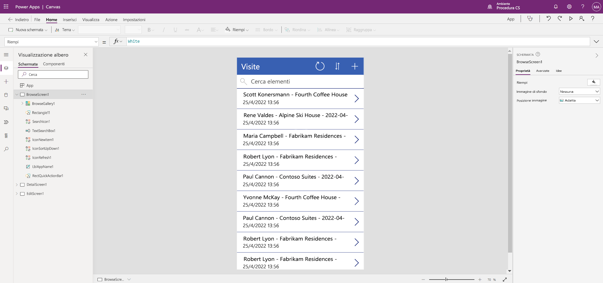

---
lab:
  title: "Lab 2: Come creare un'app canvas"
  module: 'Module 3: Get started with Power Apps'
ms.openlocfilehash: 9a9a447ac07176e7f7ed3471c105b2d06fa60c97
ms.sourcegitcommit: 8a89b7eacd1a65eaa7c5d6bff0dc7254991c4dde
ms.translationtype: HT
ms.contentlocale: it-IT
ms.lasthandoff: 07/15/2022
ms.locfileid: "147154432"
---
# Lab 2: Come creare un'app canvas

## Scenario

Il Bellows College è un'organizzazione didattica con più edifici nel proprio campus. Le visite al campus sono attualmente registrate su documenti cartacei. Le informazioni non vengono acquisite in modo coerente e non esiste un sistema per raccogliere e analizzare i dati sulle visite in tutto il campus.

Attualmente l'amministrazione del campus usa un foglio di calcolo di Excel per registrare i visitatori. Vorrebbe modernizzare il proprio sistema di registrazione dei visitatori, facendo controllare l'accesso agli edifici dal personale addetto alla sicurezza e richiedendo una preregistrazione di tutte le visite da parte degli ospiti.

Durante questo corso verranno sviluppate applicazioni e si useranno le funzionalità di automazione per consentire al personale amministrativo e addetto alla sicurezza del Bellows College di gestire e controllare l'accesso agli edifici del campus.

## Procedura generale per il lab

Verrà usata la sequenza seguente per progettare l'app canvas:

- Creare un'app canvas dai dati nella tabella Visit

- Configurare la modalità di visualizzazione delle visite nella schermata di esplorazione

- Apportare alcune modifiche di base all'app

- Testare la funzionalità dell'app

## Prerequisiti

- Completamento del **lab 0 del modulo 0 - Convalidare l'ambiente lab**
- Completamento del **lab 1 del modulo 2 - Modellazione dei dati**

## Esercizio 1: Creare un'app canvas Visits

**Obiettivo:** in questo esercizio si creerà un'app canvas connettendo la tabella Visits creata in precedenza.

### Attività \#1: Creare l'app Visits

1.  Accedere a <https://make.powerapps.com>. Potrebbe essere necessario ripetere l'autenticazione. Fare clic su **Accedi** e seguire le istruzioni se richiesto.

2.  Selezionare l'ambiente **[iniziali] Practice** in alto a destra, se non è già selezionato.

3.  Se necessario, fare clic sull'icona **Home** sul lato sinistro della schermata. Nella sezione **Inizia da** selezionare **Dataverse**.

4.  Selezionare la connessione a Dataverse.

    > **NOTA:** *se non esiste una connessione a Dataverse:*
    > - Selezionare **Nuova connessione**
    > - Individuare **Microsoft Dataverse**
    > - Fare clic su **Crea**

5.  Individuare e selezionare la tabella **Visit** creata nel lab precedente.

6.  Selezionare il pulsante **Connetti** nell'angolo in basso a destra.

7.  Dopo aver creato l'app, nella schermata Benvenuto in Power Apps Studio selezionare la casella **Non visualizzare più questo messaggio** e quindi selezionare **Ignora**.

8.  Al termine della creazione, dovrebbe essere simile all'immagine seguente.

9. Nella finestra di progettazione dell'app selezionare il pulsante di **anteprima dell'app** (icona di riproduzione) sulla barra dei comandi. *È anche possibile visualizzare l'anteprima dell'app premendo F5.* Esplorare l'app per scoprirne l'aspetto predefinito.

10. Chiudere l'anteprima dell'app selezionando la **X** in alto a destra nella schermata.

Congratulazioni, è stata creata correttamente un'app Power Apps da una tabella Dataverse. Il passaggio successivo del processo consiste nel personalizzare l'app per il college. La serie successiva di passaggi illustra come implementare alcune personalizzazioni aggiuntive per l'app.

### Attività \#2: Modificare il tema della nuova app creata

In questa attività si personalizzerà il testo dell'intestazione in ognuna delle tre schermate dell'app (Sfoglia, Dettagli e Modifica) e si modificherà il tema dell'app.

1.  È attiva la schermata Sfoglia. Selezionare l'etichetta **Visits** sullo schermo.

1.  Sul lato destro della schermata, nella scheda Proprietà, aggiornare la proprietà del controllo **Testo** impostandola su **"Bellows College Visits"** .

1. Nelle proprietà modificare le **dimensioni del carattere** su **24**.

1.  Fare clic sullo sfondo vuoto della schermata per visualizzare il testo aggiornato nella schermata Sfoglia.

1.  Usando la visualizzazione struttura ad albero nel riquadro di spostamento a sinistra, selezionare **DetailScreen1**.

1.  Selezionare l'etichetta **Visits** sullo schermo.

1.  Sul lato destro della schermata, nella scheda Proprietà, aggiornare la proprietà del controllo **Testo** impostandola su **"Visit Details"** .

1.  Fare clic sullo sfondo vuoto della schermata per visualizzare il testo aggiornato nella schermata Dettagli.

1.  Usando la visualizzazione struttura ad albero nel riquadro di spostamento a sinistra, selezionare **EditScreen1** (potrebbe essere necessario scorrere verso il basso per visualizzare questo elemento nella visualizzazione struttura ad albero).

1.  Selezionare l'etichetta **Visits** sullo schermo.

1.  Sul lato destro della schermata, nella scheda Proprietà, sostituire il testo Tabella1 nella proprietà del controllo **Testo** con **"Edit Details".**

1.  Fare clic sullo sfondo vuoto della schermata per visualizzare il testo aggiornato nella schermata di modifica.

1. Usando la visualizzazione struttura ad albero nel riquadro di spostamento a sinistra, selezionare **BrowseScreen1**.

1. Nella barra degli strumenti dei comandi selezionare il pulsante **Tema** e nell'elenco visualizzato selezionare il colore del tema **Rosso**.

### Attività \#3: Testare l'app Visits

In questa attività verrà testata la nuova app.

1.  Con l'applicazione aperta in Progettazione app selezionare **File**, aggiornare il nome dell'app in **Visits App** e selezionare **Salva**.

2.  Selezionare la freccia **Indietro** per tornare all'app.

3.  Usando la struttura di spostamento a sinistra, selezionare **BrowseScreen1**.

4.  Nella finestra di progettazione dell'app selezionare il pulsante di **anteprima dell'app** (icona di riproduzione) sulla barra dei comandi. *È anche possibile visualizzare l'anteprima dell'app premendo F5.*

4.  Dopo aver aperto l'app, nel campo **Cerca elementi** immettere il testo **Maria**
     *(Si noti come gli elementi nella raccolta vengono filtrati in base a ciò che viene digitato nel campo di ricerca).*

5.  Dopo aver visualizzato il record **Contoso Suites** per **Maria Campbell**, fare clic sulla riga per passare ad aprire i dettagli per tale visita. (**Nota**: *se vengono visualizzati più record di Contoso Suites Maria Campbell, selezionarne uno*)

6.  Per modificare il record, selezionare l'**icona a forma di matita** nell'angolo superiore destro dell'app.

7.  È possibile modificare il nome della visita qui e fare clic sull'icona Segno di spunta in alto a destra per salvare la modifica.

8.  In alto a destra della schermata fare clic sull'icona **X** per tornare all'editor dell'app canvas.

Congratulazioni! È stata creata e configurata la prima app canvas.

## Problematiche

- Aggiungere le colonne seguenti ai moduli in DetailScreen1 e EditScreen1: Actual Start, Actual End, Code, Scheduled Start e Scheduled End