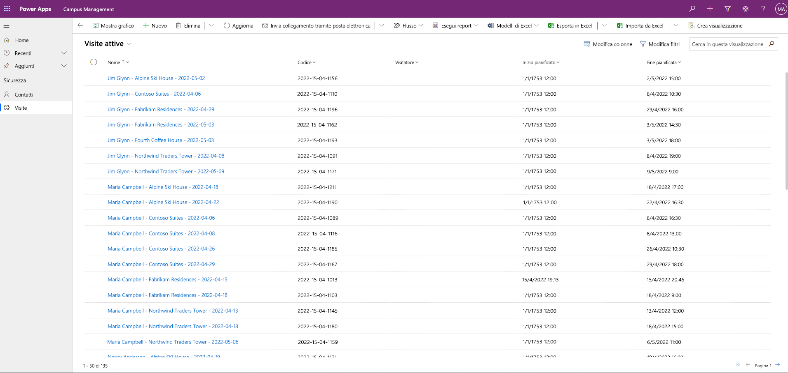

---
lab:
  title: "Lab 3: Come creare un'app basata su modello"
  module: 'Module 3: Get started with Power Apps'
ms.openlocfilehash: ed98e1f2c2ff900f84b98910e0ef2d14d130f462
ms.sourcegitcommit: dbffa13e13419f5b9aadc894eb95fd16215b2ebf
ms.translationtype: HT
ms.contentlocale: it-IT
ms.lasthandoff: 06/17/2022
ms.locfileid: "146458375"
---
# Modulo 3: Introduzione a Power Apps
## Laboratorio: Come creare un'app basata su modello

# Scenario

Il Bellows College è un'organizzazione didattica con più edifici nel proprio campus. I visitatori del campus sono attualmente registrati su documenti cartacei. Le informazioni non vengono acquisite in modo coerente e non esiste un sistema per raccogliere e analizzare i dati sulle visite in tutto il campus.

L'amministrazione del campus vorrebbe modernizzare il proprio sistema di registrazione dei visitatori, facendo controllare l'accesso agli edifici dal personale addetto alla sicurezza e richiedendo una preregistrazione di tutte le visite da parte degli ospiti.

Durante questo corso verranno sviluppate applicazioni e si useranno le funzionalità di automazione per consentire al personale amministrativo e addetto alla sicurezza del Bellows College di gestire e controllare l'accesso agli edifici del campus.

In questo lab verrà creata un'app basata su modello di Power Apps per consentire al personale di back office del campus di gestire i record delle visite per l'intero campus.

Procedura generale per il lab

Nell'ambito della creazione dell'app basata su modello verranno eseguite le operazioni seguenti:

- Creare una nuova app basata su modello denominata Campus Management

- Modificare la struttura di spostamento dell'app per fare riferimento alle tabelle richieste

- Personalizzare i moduli e le visualizzazioni delle tabelle richieste per l'app

Verranno usati i componenti seguenti:

- **Visualizzazioni**: le visualizzazioni consentono all'utente di visualizzare i dati esistenti nelle tabelle dei moduli.

- **Moduli**: in questi componenti l'utente crea nuove righe o aggiorna le righe esistenti nelle tabelle.

Entrambi questi componenti verranno integrati nell'app basata su modello per una migliore esperienza utente.

Prerequisiti

- Completamento del **lab 0 del modulo 0 - Convalidare l'ambiente lab**

- Completamento del **lab del modulo 2 - Modellazione dei dati**

- Completamento del **lab del modulo 3 - Come creare un'app canvas**

Aspetti da considerare prima di iniziare

- Quali modifiche dobbiamo apportare per migliorare l'esperienza utente?

- Cosa dobbiamo includere in un'app basata su modello basata sul modello di dati creato?

- Quali personalizzazioni possono essere effettuate nella mappa del sito di un'app basata su modello?

Esercizio 1: Personalizzare viste e moduli

**Obiettivo:** in questo esercizio verranno personalizzati i moduli e le visualizzazioni delle tabelle personalizzate create che verranno usati nell'app basata su modello.

Attività 1: Modificare il modulo delle visite

1. Accedere a [https://make.powerapps.com](https://make.powerapps.com/) se l'accesso non è già stato effettuato.

2. Selezionare l'ambiente **[iniziali] Practice** in alto a destra, se non è già selezionato.

3. Usando il riquadro di spostamento a sinistra, espandere **Dataverse**, selezionare **Tabelle** e fare clic per aprire la tabella **Visit**.

Se la tabella Visit non viene visualizzata, assicurarsi di essere nell'ambiente corretto (passaggio 2).

4. Nelle sezioni Esperienze dati selezionare **Moduli** e fare clic per aprire il modulo Information con il tipo di modulo **Main**.

**IMPORTANTE:** dato che tutti i moduli hanno il nome Information per impostazione predefinita, verificare che il modulo selezionato abbia il tipo di modulo **Main** e non un altro. Per impostazione predefinita, il modulo include due campi: Name (campo primario) e Proprietario.

5. Sul lato destro della schermata nel pannello Proprietà selezionare il campo **Nome visualizzato** e impostarlo su **Main Information**.

6. Usando il menu nella parte superiore dello schermo, selezionare **+ Campo modulo** e aggiungere i campi seguenti sotto il campo **Proprietario** trascinando le colonne nel modulo o semplicemente facendo clic sui nomi delle colonne:

    0. **Visitatore**

    1. **Start pianificato**

    2. **Scheduled End**

    3. **Actual Start**

    4. **Actual End**

7. Trascinare la colonna **Code** nell'intestazione del modulo.

L'area dell'intestazione è quella in alto a destra nel modulo. Potrebbe essere necessario comprimere il pannello Proprietà sul lato destro della schermata per visualizzare il campo nel modulo.

8. Con il campo **Code** ancora selezionato, selezionare la casella di controllo **Sola lettura** nel pannello Proprietà sul lato destro della schermata.

9. Selezionare il campo **Proprietario**. Nel pannello Proprietà impostare la proprietà **Etichetta** su **Host**.

10. Fare clic su **Salva** in alto a destra e attendere il completamento del salvataggio.

11. Fare clic su **Pubblica** in alto a destra e attendere il completamento della pubblicazione.

12. Se la visualizzazione di modifica è aperta in una nuova scheda o finestra del browser, chiuderla. In caso contrario, fare clic su **Indietro** in alto a sinistra nella schermata. Si tornerà alla scheda Moduli della tabella Visit.

13. Usando il percorso di navigazione in alto a sinistra (Tabella>Visit>Moduli), selezionare **Visit** per tornare alla schermata principale della tabella **Visit**. 

Attività 2. Modificare la visualizzazione Visit attivi/e

In questa attività verrà modificata la visualizzazione predefinita Visit attivi/e e si creerà una nuova visualizzazione per le visite del giorno.

1. Nella sezione Esperienze dati selezionare **Visualizzazioni** e fare clic per aprire la visualizzazione **Visit attivi/e**.

2. Aggiungere i campi seguenti alla visualizzazione facendo clic sui campi o trascinandoli:

    0. **Codice**

    1. **Visitatore**

    2. **Start pianificato**

    3. **Scheduled End**

3. Fare clic sulla colonna **Data creazione** e selezionare **Rimuovi**. Il campo **Data creazione** verrà ora rimosso dalla visualizzazione.

4. Ridimensionare la larghezza delle singole colonne in base ai dati.

5. Fare clic su **Salva** e attendere che le modifiche vengano salvate.

6. Fare clic su **Pubblica** e attendere il completamento della pubblicazione.

Attività 3: Creare una nuova visualizzazione per le visite del giorno

Vedremo ora come clonare la visualizzazione per creare una nuova visualizzazione per le visite del giorno.

IMPORTANTE: assicurarsi di non chiudere la visualizzazione Visit attivi/e, perché verrà sfruttata per creare la visualizzazione delle visite di oggi. 

1. Fare clic sulla **freccia in giù** accanto al pulsante Salva facendo attenzione a non fare clic sul pulsante e selezionare **Salva con nome**.

2. Modificare il nome in **Today's Visits** e fare clic su **Salva**.

3. Fare clic sul collegamento **Modifica filtri** nel pannello Proprietà.

4. Fare clic su **Aggiungi** e selezionare **Aggiungi riga**.

5. Selezionare il campo **Scheduled Start** e quindi selezionare **Oggi** come condizione nell'elenco a discesa.

6. Fare clic su **…** nella riga **Stato** e fare clic su **Elimina** per eliminare tale condizione di filtro.

7. Fare clic su **OK** per salvare la condizione. La visualizzazione viene ora filtrata in modo da mostrare solo i record in cui la data Scheduled Start corrisponde alla data odierna.

8. Aggiungere i campi **Actual Start** e **Actual End** alla visualizzazione.

**Nota:** dato che i dati non sono più filtrati in base allo stato, otterremo un elenco delle visite del giorno che include anche quelle completate. Questi campi serviranno a distinguere le visite completate da quelle in corso.

1. Fare clic su **Salva**.

2. Fare clic su **Pubblica** e attendere il completamento della pubblicazione.

Esercizio 2. Creare un'applicazione basata su modello

**Obiettivo:** in questo esercizio si creerà l'app basata su modello, si personalizzerà la mappa del sito e quindi si testerà l'app.

Per semplicità e per ragioni di tempo, non verranno usate alcune delle colonne Visit in questo lab.

Attività 1: Creare l'applicazione

1. Accedere a [https://make.powerapps.com](https://make.powerapps.com/) se l'accesso non è già stato effettuato.

2. Selezionare l'ambiente **[iniziali] Practice** in alto a destra, se non è già selezionato.

3. Creare l'applicazione basata su modello:

    0. Selezionare **App vuota** nella sezione **Inizia da** della schermata Home.

    1. In **App vuota basata su Dataverse** selezionare **Crea**.

    2. Immettere **Bellows Campus Management** per Nome e selezionare **Crea**.

4. Dopo il caricamento della nuova applicazione basata su modello, selezionare il pulsante **+ Aggiungi pagina**.

5. Nella schermata Aggiungi pagina scegliere **Visualizzazione basata su tabella e modulo** e quindi selezionare il pulsante **Avanti**.

6. Aggiungere le tabelle seguenti:

    0. Visitare

    1. Contatto

7. Dopo aver selezionato le 2 tabelle, selezionare **Aggiungi**.

8. Usando le icone di spostamento su lato sinistro della schermata, selezionare **Spostamento**.

9. Nel riquadro di spostamento selezionare **Gruppo 1** sotto a Barra di spostamento.

10. Sul lato destro della schermata, nella sezione **Opzioni di visualizzazione** impostare la proprietà **Titolo** su **Sicurezza**.

Attività 2. Modificare l'app

Adesso che tutti i componenti necessari sono stati aggiunti all'applicazione basata su modello, è ora di organizzare gli elementi.

1. Nel riquadro di spostamento, nel gruppo di sicurezza, selezionare **SubArea1**.

2. Selezionare i **puntini di sospensione verticali** e nel menu visualizzato selezionare l'opzione per rimuovere **SubArea1**.

3. Usando la barra di spostamento sul lato sinistro della schermata, selezionare **Pagine**.

4. Individuare ed espandere **Visit** nel riquadro Pagine.

5. Selezionare **Modulo Visit**.

6. Sul lato destro dello schermo selezionare **Aggiungi modulo**.

7. Selezionare il modulo **Main Information**.

8. In **Visit** nel riquadro Pagine selezionare **Visualizzazione Visit**.

9. Sul lato destro dello schermo selezionare **Aggiungi visualizzazione**.

10. Selezionare la visualizzazione **Today's Visits**.

11. Selezionare nuovamente **Aggiungi visualizzazione**. 

12. Selezionare la visualizzazione **Visit attivi/e**. 

13. Selezionare **Salva**.

14. Al termine del **salvataggio** selezionare il pulsante **Pubblica** per pubblicare le modifiche.

Attività 3: Testare l'applicazione

1. Avviare l'applicazione

    0. Selezionare **Riproduci** per aprire l'app in una nuova finestra.

2. Creare un nuovo contatto

    0. L'app verrà aperta nella visualizzazione **Contatti attivi**. In caso contrario, selezionare Visit a sinistra.

    1. Fare clic su **Nuovo** nel menu principale.

    2. Specificare John per **Nome** e Doe per **Cognome**.

    3. Specificare l'indirizzo e-mail personale per **E-mail**. Verrà usato in un lab futuro in cui si riceverà un messaggio di posta elettronica.

    4. Fare clic su **Salva e chiudi**.

    5. Il nuovo contatto creato dovrebbe essere ora visibile nella visualizzazione **Contatti attivi**.

3. Creare una nuova visita

    0. Selezionare **Visit** nella mappa del sito.

    1. Fare clic su **Nuovo**.

    2. Compilare i campi come segue

        0. **Nome**: New test visit

        1. **Visitor**: selezionare John Doe

        2. **Scheduled Start**: selezionare la data di domani e le 14:00 come ora di inizio

        3. **Scheduled End**: selezionare la data di domani e le 15:30 come ora di fine

- Fare clic su **Salva e chiudi**. Verrà così creata la visita che dovrebbe essere visibile nella visualizzazione Visit attivi/e.

- Passare alla visualizzazione **Today's Visits**. La nuova visita non dovrebbe essere più visibile in questa visualizzazione, perché è pianificata per il giorno successivo.

4. È possibile aggiungere altri record di prova.

L'app in esecuzione dovrebbe essere simile alla seguente:

Congratulazioni! È stata creata e configurata la prima app basata su modello.

# Problematiche

-   Selezionare visualizzazioni e moduli specifici per Contatti
