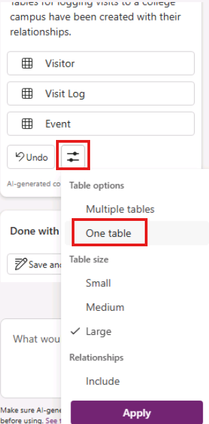
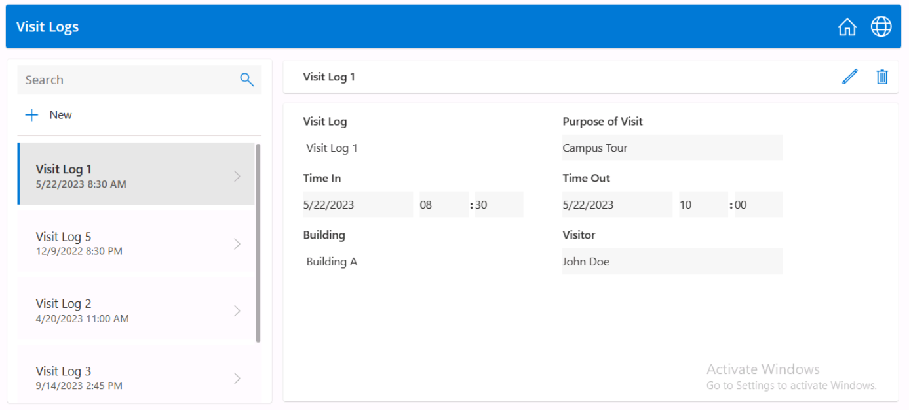

---
lab:
  title: 'Bonus Lab: creare un''app canvas con Copilot'
  module: 'Module 3: Describe how to build applications with Microsoft Power Apps'
---

# Bonus Lab: creare un'app canvas con Copilot

**Tenant WWL: condizioni per l'utilizzo** Se, come parte della distribuzione di formazione con istruttore, viene fornito un tenant, tenere presente che il tenant viene reso disponibile allo scopo di supportare le esercitazioni pratiche nel training con docente. I tenant non devono essere condivisi o utilizzati per scopi esterni alle esercitazioni pratiche. Il tenant usato in questo corso è un tenant di valutazione e non può essere usato o risultare accessibile dopo che la lezione è finita e non è idonea per l'estensione. I tenant non devono essere convertiti in un abbonamento a pagamento. I tenant ottenuti come parte di questo corso rimangono di proprietà di Microsoft Corporation e Microsoft si riserva il diritto di ottenere l'accesso e di riprenderne il possesso in qualsiasi momento. 

## Scenario

Bellows College è un'organizzazione educativa con più edifici nel campus. I visitatori del campus sono attualmente registrati in giornali di registrazione cartacei. Le informazioni non vengono acquisite in modo coerente e non ci sono mezzi per raccogliere e analizzare i dati sulle visite nell'intero campus.

L'amministrazione del campus vorrebbe modernizzare il proprio sistema di registrazione dei visitatori, facendo controllare l'accesso agli edifici dal personale addetto alla sicurezza e richiedendo una preregistrazione di tutte le visite da parte degli ospiti.

In questo lab, si userà Copilot per creare una nuova applicazione canvas per la registrazione delle visite. 

## Procedura generale per il lab

Seguire la sequenza seguente per progettare l'app canvas:

- Descrivere l'app che si intende sviluppare

- Usare Copilot per modificare la struttura della tabella di supporto

 ## Prerequisiti

- Completamento del **Modulo 1 Lab 0 - Convalidare l'ambiente lab**

## Esercizio 1: Usare Copilot per creare un’app per le visite all’università.

**Obiettivo:** In questo esercizio si creerà un'app canvas connettendosi a una tabella visite del campus.

### Attività \#1: Creare l'applicazione iniziale

1. Accedere a `https://make.powerapps.com`.

2. Potrebbe essere necessario ripetere l'autenticazione. Selezionare **Accedi** e seguire le istruzioni, se richiesto.

3. Selezionare l'ambiente **Dev One** in alto a destra, se non è già selezionato.

4. Selezionare **+ Crea** dal riquadro di spostamento a sinistra della schermata. Nella **sezione Crea app** selezionare **Inizia con Copilot**.

5. Nella **casella Introduzione a Copilot** immettere il testo seguente. `Create an application that logs visits to a college campus`. 

6. Selezionare il pulsante **Genera**.

Copilot inizierà a creare una struttura sotto forma di tabella per supportare l'applicazione. 

> **IMPORTANTE:** Usando l’IA generativa, non si otterranno sempre gli stessi risultati esatti. È possibile che la tabella non corrisponda esattamente alla tabella creata per un altro studente. 

7. Sul lato destro selezionare struttura di tabella nella finestra Copilot e quindi selezionare **Opzioni** tabella.

8. Selezionare **Un'opzione tabella** e quindi applica****.
 
    

> Per visualizzare la struttura della tabella, selezionare la tabella e fare clic sul **pulsante Visualizza dati** 

9. **Nella casella What would you like to do next? (Cosa si vuole fare successivamente?** immettere il testo: Aggiungere due colonne, Time in e Timeout nella tabella). Entrambi devono essere campi di data e ora. 

10. Selezionare il pulsante **Vai** o premere **Invio**. 

11. Scorrere fino al lato della tabella e verificare che le **colonne Time in** e **Timeout** siano state create. 

Dal momento che registriamo l’entrata e l’uscita dei visitatori, non abbiamo bisogno di altri campi che riportino la data della visita. 

12. Individuare il **campo Data** visita (o campo equivalente) e nella **casella Cosa si desidera eseguire?** immettere il testo: Rimuovi il campo Data visita (o campo equivalente). 

>Se necessario, aggiornare il nome del campo da rimuovere dal nome della tabella pertinente.

13. Selezionare il pulsante **Vai**. 

14. Rimuovere altri eventuali campi con la data diversi da **Entrata** e **Uscita**. 

Inizialmente è stato aggiunto il campo **Scopo** formattato con un tipo di dati di testo. Copilot lo trasformerà in un menu a discesa (a scelta). 

15. Nella sezione **Cosa si vuole fare successivamente?** immettere il testo seguente: Modificare il campo Scopo in un menu di scelta con le opzioni seguenti: Campus Tour, Career Fair, Meet with Professor, Student Counseling, Other. 

16. Selezionare il pulsante **Vai**. 

17. Poiché si vuole acquisire anche il numero di edificio, immettere: Aggiungere una colonna di compilazione in **What would you like to do next?, in What would you like to do next?**, enter: Add a building column. 

18. Selezionare il pulsante **Vai**. 

19. Dopo aver soddisfatto la tabella, selezionare il **pulsante Salva e apri app** . 

20. Se necessario, nella **schermata Fine?** selezionare **Non chiedere di nuovo** e selezionare il **pulsante Salva e apri app** . 

Congratulazioni, è stato usato Copilot per creare una nuova app. 
