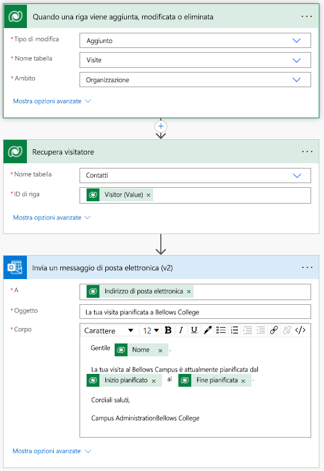

---
lab:
  title: 'Lab 4: Come creare una soluzione automatizzata'
  module: 'Module 4: Get Started with Power Automate'
ms.openlocfilehash: 35d4b6940f31e1a2aef5e8b43d8ca7007e1b72f2
ms.sourcegitcommit: 8a89b7eacd1a65eaa7c5d6bff0dc7254991c4dde
ms.translationtype: HT
ms.contentlocale: it-IT
ms.lasthandoff: 07/15/2022
ms.locfileid: "147154324"
---
# Lab 4: Come creare una soluzione automatizzata

## Scenario

Il Bellows College è un'organizzazione didattica con più edifici nel proprio campus. I visitatori del campus sono attualmente registrati su documenti cartacei. Le informazioni non vengono acquisite in modo coerente e non esiste un sistema per raccogliere e analizzare i dati sulle visite in tutto il campus.

L'amministrazione del campus vorrebbe modernizzare il proprio sistema di registrazione dei visitatori, facendo controllare l'accesso agli edifici dal personale addetto alla sicurezza e richiedendo una preregistrazione di tutte le visite da parte degli ospiti.

Durante questo corso verranno sviluppate applicazioni e si useranno le funzionalità di automazione per consentire al personale amministrativo e addetto alla sicurezza del Bellows College di gestire e controllare l'accesso agli edifici del campus.

In questo lab si creerà un flusso di Power Automate per inviare un messaggio di posta elettronica a un visitatore quando viene pianificata una visita.

## Procedura generale per il lab

Per completare il progetto sono stati identificati i requisiti seguenti:

- I contatti devono ricevere una notifica tramite posta elettronica quando viene pianificata una visita.

## Prerequisiti

- Completamento del **lab 0 del modulo 0 - Convalidare l'ambiente lab**
- Completamento del **lab 1 del modulo 2 - Modellazione dei dati**
- Completamento del **lab 3 del modulo 2 - Come creare un'app basata su modello**
- Contatto John Doe creato con un indirizzo di posta elettronica personale

## Esercizio 1: Creare un flusso di notifica visita

**Obiettivo:** in questo esercizio verrà creato un flusso di Power Automate che implementa il requisito. Il visitatore deve ricevere un messaggio di posta elettronica con il codice univoco assegnato alla visita al momento della creazione.

### Attività \#1: Creare un flusso

1.  Accedere a <https://make.powerapps.com>. Potrebbe essere necessario ripetere l'autenticazione. Fare clic su **Accedi** e seguire le istruzioni se richiesto.

2.  Selezionare l'ambiente **[iniziali] Practice** in alto a destra, se non è già selezionato.

3.  Nel riquadro di spostamento a sinistra selezionare **Flussi**.

4.  Se richiesto, selezionare **Attività iniziali**.

5.  Fare clic su **Nuovo flusso** e selezionare **Flusso cloud automatizzato**.

6.  Immettere "Visit Notification" per **Nome flusso**.

7.  In **Scegliere il trigger del flusso** cercare **Dataverse**.

8.  Selezionare il trigger **When a row is added, modified or deleted** (Quando una riga viene aggiunta, modificata o eliminata) e quindi fare clic su **Crea**.

9.  Popolare le condizioni di trigger per il flusso:

    1.  Selezionare **Aggiunte** per **Tipo di modifica**

    2.  Selezionare **Visit** per **Nome tabella**.

    3.  Selezionare **Organizzazione** per **Ambito**.

    4.  Nel passaggio del trigger fare clic sui puntini di sospensione ( **...** ) e fare clic su **Rinomina**. Rinominare il trigger **"When a visit is added"** (Quando viene aggiunta una visita). Questa è una procedura consigliata, per consentire all'utente e agli altri editor del flusso di comprendere lo scopo del passaggio senza dover esaminare i dettagli.

### Attività \#2: Creare un passaggio per ottenere la riga del visitatore

1.  Selezionare **+ nuovo passaggio**. Questo passaggio è necessario per recuperare le informazioni sui visitatori, incluso l'indirizzo e-mail.

2.  Cercare **Dataverse**.

3.  Selezionare l'azione **Recupera una riga tramite ID**.

4.  Selezionare **Contatti** per **Nome tabella**.

5.  Selezionare il campo **ID riga**. Si noti che viene visualizzata una finestra per selezionare Contenuto dinamico o Espressioni.

6.  Nel campo **ID riga** selezionare **Visitor (Valore)** nell'elenco del contenuto dinamico. In questo passaggio si sta cercando il contatto (Contact) per la riga Visit creata per attivare questo flusso. Poiché l'indirizzo di posta elettronica fa parte della tabella Contact, queste informazioni saranno necessarie per inviare il messaggio di posta elettronica al visitatore.

7.  In questa azione fare clic sui puntini di sospensione ( **...** ) e scegliere **Rinomina**.
        Rinominare l'azione **"Get the Visitor"** . Questa è una procedura consigliata, per consentire all'utente e agli altri editor del flusso di comprendere lo scopo del passaggio senza dover esaminare i dettagli.

### Attività \#3: Creare un passaggio per inviare un messaggio di posta elettronica al visitatore

1.  Fare clic su **+ Nuovo passaggio**. Questo è il passaggio che invierà il messaggio di posta elettronica al visitatore.

2.  Cercare *mail*, selezionare il connettore **Office 365 Outlook** e l'azione **Invia un messaggio di posta elettronica (v2)** .

3.  Se viene richiesto di accettare i termini e le condizioni per usare questa azione, fare clic su **Accetta**.

4.  Selezionare **Aggiungi contenuto dinamico** nel campo **A**. 
    
5.  Selezionare **Posta elettronica** nell'elenco del contenuto dinamico.
        > Notice that it is beneath the **Get the visitor** header. This means you
        are selecting the Email that is related to the Visitor that you looked
        up in the previous step.

6.  Immettere **Your scheduled visit to Bellows College** nel campo **Oggetto**.

7.  Immettere il testo seguente in **Corpo**:

>   Il contenuto dinamico deve essere inserito nei campi con nome tra parentesi graffe. È consigliabile copiare e incollare prima tutto il testo e poi aggiungere il contenuto dinamico nelle posizioni corrette.

~~~~~~~~~~~~~~~~~~~~~~~~~~~~~~~~~~~~~~~~~~~~~~~~~~~~~~~~~~~~~~~~~~~~~~~~~~~~~~~~
   Dear {First Name},

   You are currently scheduled to visit Bellows Campus from {Scheduled Start} until {Scheduled End}.

   Best regards,

   Campus Administration
   Bellows College
~~~~~~~~~~~~~~~~~~~~~~~~~~~~~~~~~~~~~~~~~~~~~~~~~~~~~~~~~~~~~~~~~~~~~~~~~~~~~~~~

8.  Evidenziare il testo **{First Name}** . Sostituirlo con il campo **First Name** del passaggio **Get the Visitor** .

9.  Evidenziare il testo **{Scheduled Start}** . Sostituirlo con il campo **Scheduled Start** dal passaggio **When a visit is added**.

10.  Evidenziare il testo **{Scheduled End}** . Sostituirlo con il campo **Scheduled End** dal passaggio **When a visit is added**.

11.  Fare clic su **Salva**.

Lasciare questa scheda del flusso aperta per la prossima attività. Il flusso dovrebbe essere simile al seguente:

### Attività \#4: Convalidare e testare il flusso

1.  Aprire una nuova scheda nel browser e passare a <https://make.powerapps.com>.

2.  Selezionare l'ambiente **[iniziali] Practice** in alto a destra, se non è già selezionato.

3.  Fare clic su **App** e selezionare l'app **Bellows Campus Management** basata su modello creata in precedenza.

3.  Lasciare aperta questa scheda del browser e tornare alla scheda precedente con il flusso.

4.  Sulla barra dei comandi fare clic su **Test**. Selezionare **Manualmente** e quindi fare clic su **Test**.

5.  Passare alla scheda del browser con l'app basata su modello aperta. 

6.  Usando la struttura di spostamento a sinistra, selezionare **Visit**.

6. Fare clic sul pulsante **+ Nuovo** per aggiungere un nuovo record **Visit**.

7. Completare il record Visit come segue:

    -   **Nome:** Test Visit

    -   **Visitor:** John Doe

    -   **Scheduled Start:** Domani alle 8:00

    -   **Scheduled End:** Domani alle 9:00

8. Selezionare il pulsante **Salva e chiudi**.

9. Passare alla scheda del browser con il test del flusso in esecuzione. Dopo un breve ritardo, dovrebbe essere visualizzato il flusso in esecuzione. Durante questa fase è possibile rilevare eventuali problemi nel flusso o verificare che venga eseguito correttamente.

Dopo un breve ritardo, dovrebbe essere visualizzato un messaggio di posta elettronica nella posta in arrivo, dato che è stato specificato l'indirizzo di posta elettronica personale come indirizzo di posta elettronica di John Doe. Si noti che potrebbe essere inserito nella cartella Posta indesiderata.

## Problematiche

- Sperimentare con la formattazione nel messaggio di posta elettronica. Come si potrebbe ottenere un aspetto più professionale?